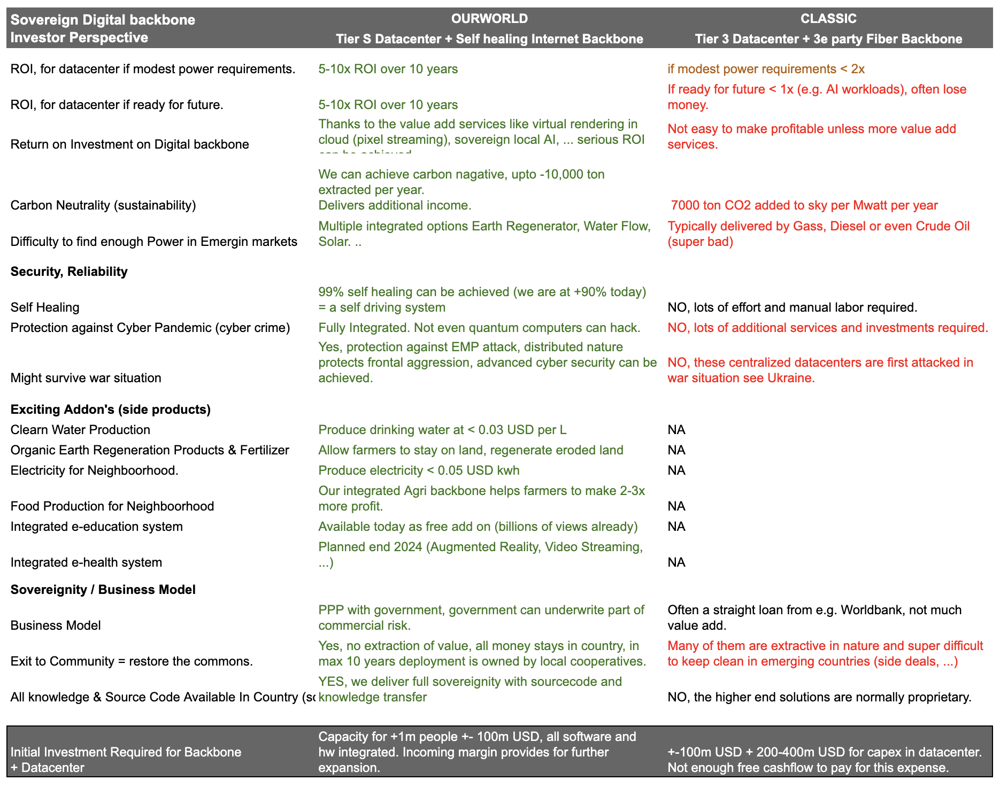
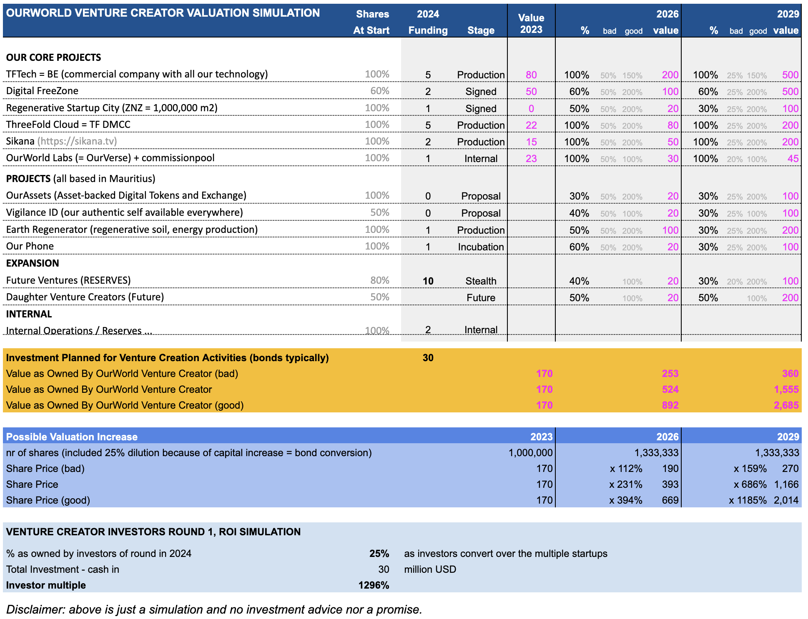
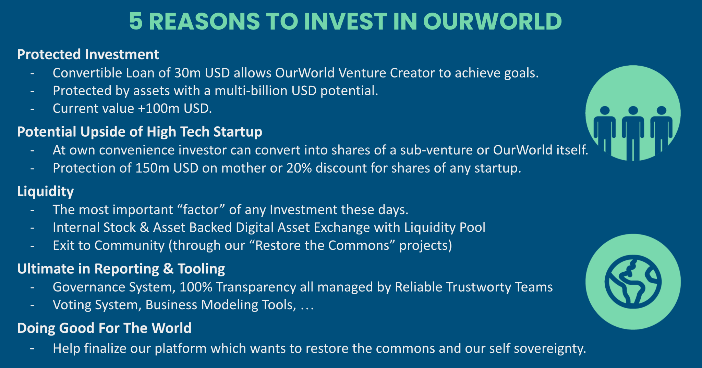
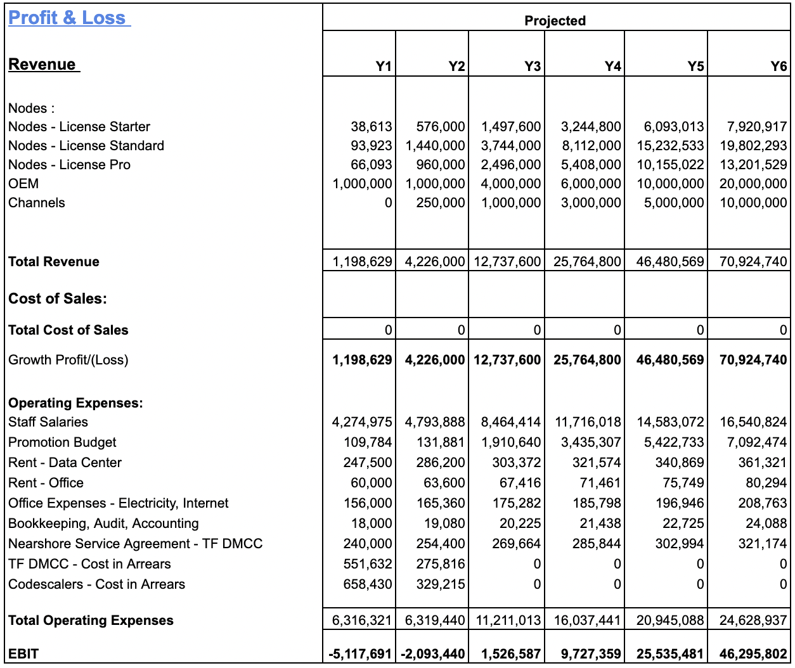
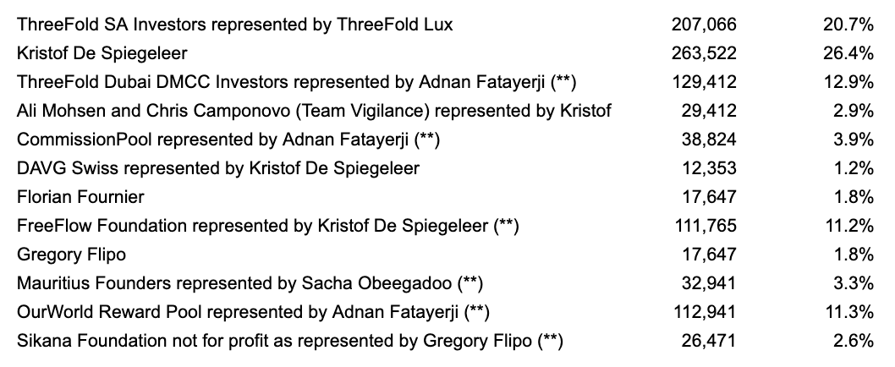

# List of questions as asked for by Greg Dec 4 2023

## One of our cash generators short term = Tier S Datacenters

See [https://info.ourworld.tf/datacenter/](img/https://info.ourworld.tf/datacenter/). 

Classic Tier 3 Data Centers are being invested in everywhere in the world. These are good investments but because of the AI revolution these data centers are no longer good enough to fulfill the needs of the future.

There is lots of funding available to make these projects fly.

Reasoning goes as follows

An investor which wants to invest in datacenters can chose a Tier 3 Datacenter 

* Return of maybe 10% if they do well per year.
* Good assets behind (real estate), good protection
* Not ready for AI workloads
* Super difficult to generate power for (electricity), many places run on diesel or crude oil
* They don’t have the expertise to make them work well commercially
* 
Or they can chose a Tier S Datacenter

* Return of x6 over 6 years is possible.
* Ready for any future workload.
* A Tier S is a datacenter that’s carbon negative (good for the planet)
* A lot less expertise needed to run them.

See the business model around our Tier S datacenter in [this document](datacenter_biz/overview.md)

### A high level overview why an investor in a datacenter would prefer to invest in Tier S datacenter

See the following table in [this document](img/https://docs.google.com/spreadsheets/d/1UEpEyQ1wRXk-S9NsGTVKEy190nSYx4MJ0jdwyOYN6Zk/edit#gid=1337491067), where we can see how a country has a big benefit for such a Tier S datacenter.

### Biz Model for TFTech for Tier S datacenters

Licenses for the Tier S datacenters are sold by TFTech, and we outsource all logistics and building elements to local partners.

The income for ThreeFold is about 15m USD for a 5 megawatt Tier S datacenter over 6 years.

See the detailed calculator on [the following document](img/https://docs.google.com/spreadsheets/d/1HXIiLSbuEE7bfg9grD9Fs2I56MmE-zBCi_2FzUuQOiQ/edit#gid=1159987235) (best to ask Kristof to explain).

## Our World Value Creation

Based on the value creation of our startups. As an investor in OurWorld Venture creator you have the upside of high tech startups and the downside protection of a bond is backed by the different companies. 

## 

Note for 2023 terms are better as what described above (33% on 150m USD post, vs pre later)

## OurWorld Assets

* 60% of shares of digital freezone ZNZ

* 60% of 100 ha land in ZNZ for a regenerative startup city

* 100% of TFTech (our tech company, owns all IP)

* 100% of TF Dubai (our cloud company, today only manages open source movement)

* 100% Sikana (educational video platform)

## TFTech High Level Budget

Only one of the startups from the Venture Creator

TFTech commercializes the software as has been used in our opensource projects.

Belgium company, the business model is very simple.

We support the TFGrid with upselling to TFGrid commercial farmers, this is done by licenses per node (see above), we also plan to do some OEM deals because this shows traction and is good for future potential M&A discussions.

The Tier S datacenters are expected to be our main business over the next few years, each datacenter can bring in 5-10x ROI over 6 years.

Funding required to execute on the above plan is 5m EUR. 

## Investments done

OurWorld Holding will own 100% of ThreeFold Dubai, TFTech, Sikana and technology as developed by Incubaid. 

More than 50m USD has been invested over these companies and projects by investors and members of the community.

* 20m EUR in TFTech (convertible loan, which converted into shares in a luxembourg holding company), ourworld will own 100% of Sikana.

* +-15-20m EUR by farmers (TF Community Members) who invested in hardware and datacenter opex costs, to build out the TF Grid.

* +-10m EUR by Kristof in ThreeFold Dubai, the cloud company using the opensource TF Technology to build out the grid. This funding was over the last 5 years.

* 15m USD was invested in Sikana over the years, ourworld will own 100% of Sikana.

## Investments Commitments

* Simanta : 

    * 10m EUR with option of 10m EUR more

    * Signed Investment Agreement

    * 2m EUR < end Jan 2024, 8m EUR once DD done (which is +- done now)

    * 10m EUR after share swap

    * Agreement is conversion at 20% discount on any future defined valuation with a maximum of 150m-33% discount (post), Simanta can choose to convert any time at that valuation.

* DAVG (investor group from Lux/CH)

    * 5-10m EUR

    * Signed Term Sheet

    * Expected Closing Q1 2024

There is a funnel for more investors, we expect to close the round in Q1 2024.

## Terms for new Investors 2023

Everyone investing in 2023 can have the exact same terms as Simanta

Starting 2024 the terms will be the same apart from the max conversation valuation which will be 20% (instead of 33% post) and based on pre-money valuation (not post).

## List of investors In OurWorld Holding

Today Kristof owns 100% of OurWorld Holding, every new investor comes in through a preferred convertible loan, Q1 2024 we will transfer the shares to all shareholders below.

After the TFTech share swap to be executed in Q1 2024 the new shareholders are as follows:

Expected loans

* 10-20m EUR Simanta, he will probably chose to convert

* 5-10m EUR DAVG, they will also probably chose to convert

* We have other interested investors 

