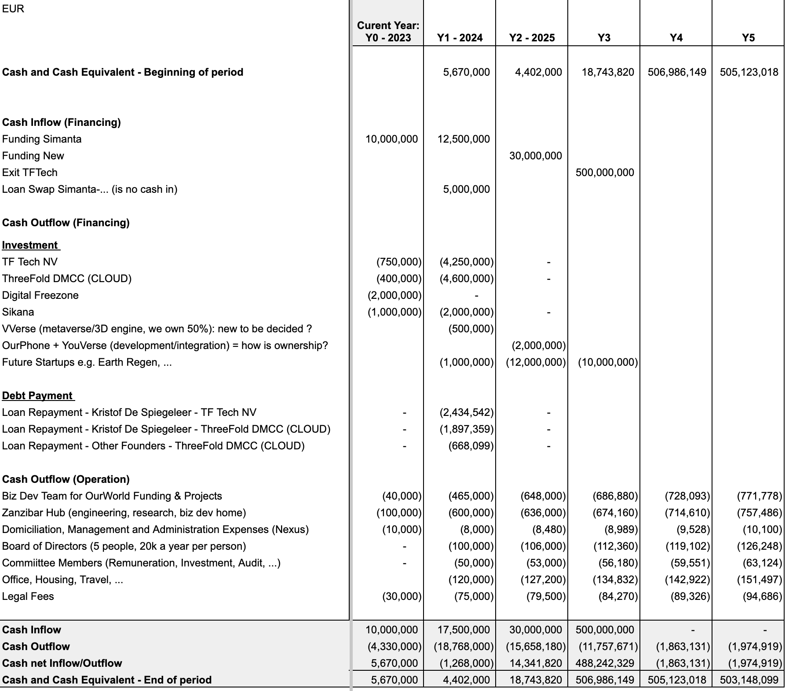
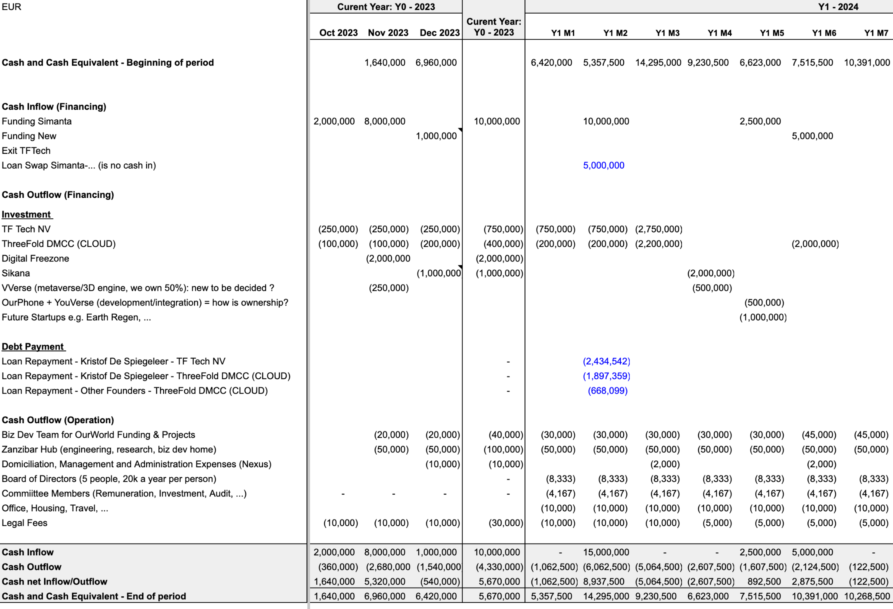
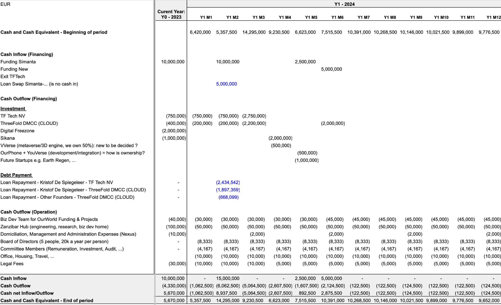

# 

# Venture Creator Cashflow

* Our Mother Company
* +-100k per month
* Q1 2024: Expand team
    * CFO
* Our Focus Point Projects
    * Sell first Tier-S Datacenter
    * Together with Financial partner conclude on PPP project with government around Undersea Internet Cable as well as Tier-S Edge Datacenter Capacity
    * Close on our planned ventures (JV's)

# Investments Roadmap

The OurWorld Investment committee has to agree on the following investment milestones and will only be executed once enough funding is in.

- TFTech: 
  - initial 2.5m EUR after 10m USD in OWVC
  - +2.5m EUR after 20m USD in OWVC
- Sikana
  - Initial 1m EUR after 10m USD in OWVC
  - +1m EUR after 20m USD in OWVC
- TFCloud: after +15m USD
  - initial 2.5m EUR after 10m USD in OWVC
  - +2.5m EUR after 20m USD in OWVC

## TFTech (Belgium)

* burnrate +- 250k EUR per month until shareswap is completed, as a loan which converts into share swap.
* Once shareswap completed and +20m EUR on bank, Q1 2024: complete the planned 5m EUR funding (so total funding is 5m EUR included the monthly funding from nov till that point)
* End Q1 2024: Expand team
    * Commercial CEO and Operational COO to start with
* Milestones to achieve
    * Deliver tech components as needed for our initial projects e.g. Vigilance, TFCloud Mycelium, Zanzibar, …
    * Shareswap to ZNZ
    * Close project for Internet/Cloud in ZNZ
    * Close good MOU with TNZ for Internet/Cloud

## TF Cloud (Dubai)

* 100k USD funding per month until finalization of DD, as loan which converts into share swap.
* Add 100k USD per month, once DD and 10m EUR to the bank in OurWorld.
* Once +20m EUR on bank, complete the planned 5m EUR funding (so total funding is 5m EUR included the monthly funding from nov till that point)
* Go to max 250k USD burn rate
* Q1 2024: Expand team
    * COO + Product Manager + Web Operations Manager
* Milestones to achieve
    * TFGrid 4.0, H1 2024
    * Launch of mycelium: see [https://github.com/threefoldfoundation/info_cloud_production](img/https://github.com/threefoldfoundation/info_cloud_production) 
    * At least 25k eur per month recurring revenue by Q2 2024 for cloud products on our new cloud products

## Digital Freezone 

* 50k USD funding per month until finalization of DD and 10m EUR on the bank account OurWorld.
* Add 50k USD per month, once DD and 10m EUR to the bank.
* Once the shareswap completed and +20m EUR on bank, Q1 2024: complete the planned 2m EUR funding (so total funding is 5m EUR included the monthly funding from nov till that point)
* Team in place (all based on good will now)
    * CEO/CLO/CSO + bizdev
* Expand team
    * CEO + Product Manager
* Milestones to achieve
    * Legal work done for the freezone initial product offering
    * Initial product offering life < end H1 2024
    * All docs in place and minimal set of tools
* Initial offering
    * Personal Legal/Financial twin 
        * Is your own 100% owned company in freezone
    * With all required tooling

## Sikana, Q1 2024

* 2m EUR in Q2 2024 (after 20m EUR min investment on bank)
* Budget to be reviewed at that stage.
* Milestones to achieve
    * Sikana running on top of TFGrid 4.0
    * + 10 ngo signed on to promote and be part of offering
    * Content translated to Swahili for the +100 best educational pieces

# CASHFLOW

Detail:

> TODO: alex, need to update to dec 2023 status