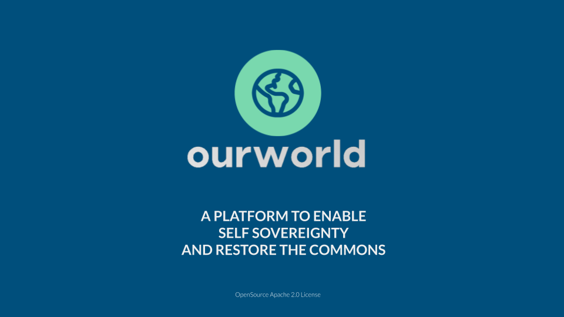
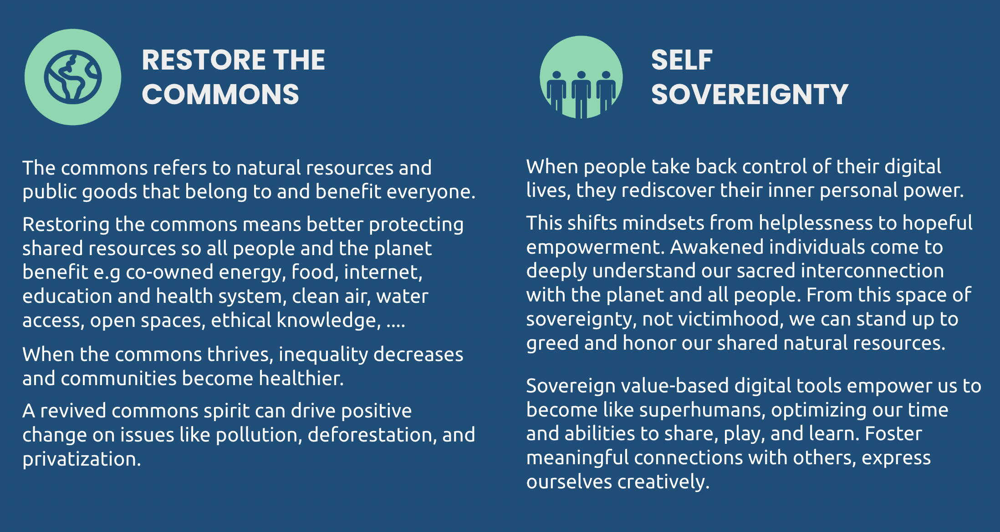

In a world where fear and greed prevail, we find ourselves in an incredibly exciting time where everything is possible. 

We believe that many of the challenges we face today, such as clean energy and water, combating desertification, waste repurposing, healthy living, CO2 sequestration, and sustainable lifestyles, have already been resolved. 

However, due to the influence of fear and greed, these much-needed innovations don’t find their way to market in an abundance-based way. We believe there are more than enough resources available in the world to allow everyone to have a prosperous and meaningful life. 

Can you imagine a world where:

* Everyone is fully sovereign and can create their own future?
* Everyone has access to a working democratic Internet?
* Everyone has access to healthy food and medicine?
* Everyone has endless opportunities to learn and be creative?
* No one needs to live in fear, but we all learn to trust each other again?
* Money is a beautiful source of energy which allows us to create a better world together? 
* We no longer have to depend on centralized services which are taking advantage of our data and manipulating our information?

OurWorld Venture Creator's mission is to help make this world a reality, and we can only do this by fundamentally changing the thought processes that caused the problems in the first place.

We are a passionate group of entrepreneurs and technologists who want to help create an antidote. We have a concrete plan which starts with a conscious funding model. We have already developed a new decentralized infrastructure layer for the Internet and Web 3.0, and we are now looking for partners with meaningful projects focused on harnessing the power of nature to make sure we are operating everything in a regenerative way.