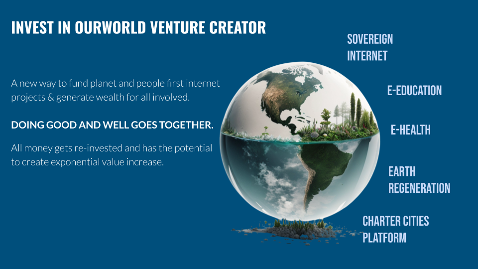

# Invest In OurWorld Venture Creator

Imagine a funding mechanism which:

* Allows you to do good for the world as well as for your family and yourself
* Gives you the potential upside of a high tech startup
* Gives you the protection of an asset-backed bond (backing by shares of all our companies) 
* Gives you flexibility of a stock exchange
* Allows you to deploy billions of dollars (through our Daughter Venture Creators and The Commons Utility Projects, which are infrastructure projects using our technology)
* Allows you to invest in a flexible way (Gold, USD, Digital Currencies, Dubai, Europe, US, Mauritius, …)

We are fundraising 30m EUR in phase one, but will be expanding in phase two.

OurWorld Venture Creator offers investors an attractive and flexible investment opportunity through a tokenized bond, with the potential to convert at a discounted rate into shares of OurWorld Venture Creator, TFTech or any of the other startups as created by the Venture Creator.

Our intention is to enable “Commons” based infrastructure projects delivering, for example, clean energy, safe Internet capacity, earth regeneration, healthy food, clean water, authentic e-education and e-health. We are working with financial partners to structure vehicles that could mobilize billions of USD for these “Commons” based projects. Once the projects are operational and providing return, community-owned Cooperative structures will buy back the shares of these projects as well as from the Venture Creator. This provides for the INXIT as defined below.