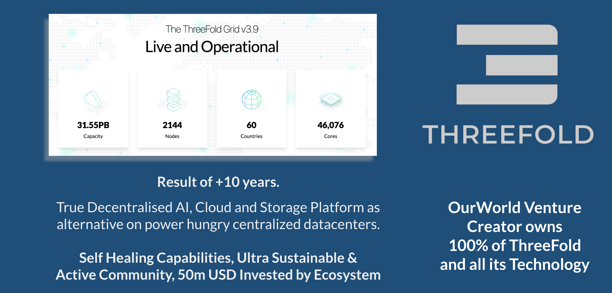
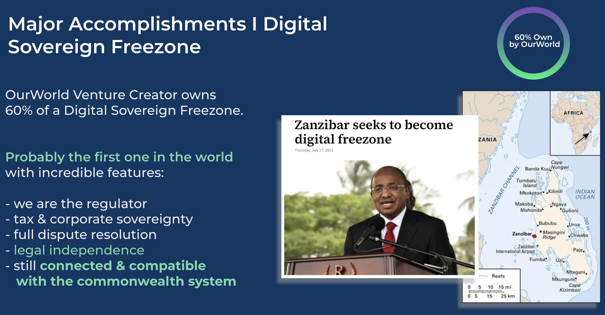
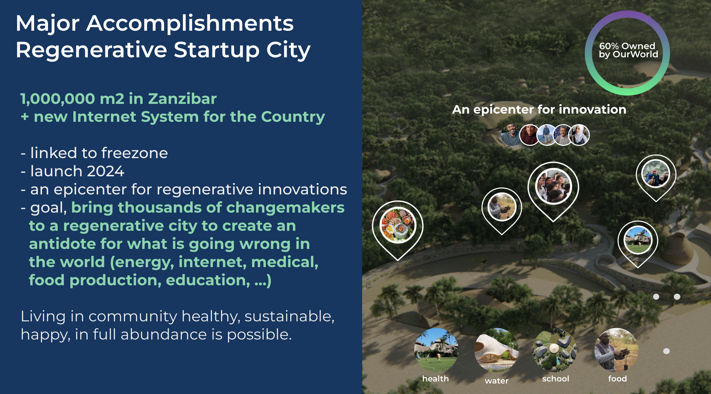
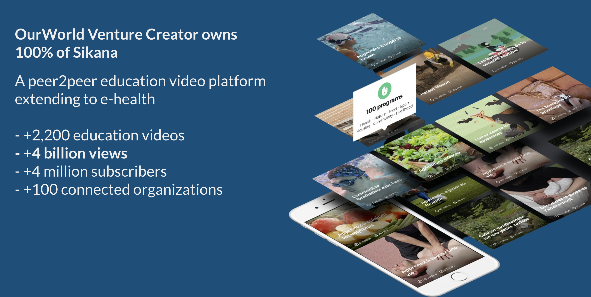

# OurWorld Venture Major Achievements

We are the proud creator and owner of some incredible projects. 

## ThreeFold

* ThreeFold Grid is active for years
* TFGrid is a distributed cloud and internet technology demonstrating the capabilities of our tech.
  * generation 3, every day the community is adding capacity and using it
  * see [https://dashboard.grid.tf/explorer/statistics](https://dashboard.grid.tf/explorer/statistics)
* The community invested more than 30m USD.
* We are in advanced conversations with 2 countries to deploy a sovereign internet which can be done by deploying Tier S datacenters, see [https://info.ourworld.tf/datacenter](https://info.ourworld.tf/datacenter)

## Sovereign Digital Freezone

We are establishing **OurWorld Digital Free Zone in partnership with the government of Zanzibar.** 

Imagine a world where you can do frictionless business at the speed of light, using our co-owned, co-agreed financial and regulatory framework. 

This zone has the ability to deliver true financial, business and information freedom with a special focus on authenticity. Our aim is to bring millions of people together in this zone digitally and make it affordable for all. Such a zone can be used to organize co-ownership structures, security token offerings, legal supported DAO’s, etc.

- OurWorld Venture Creator owns 60% of a Digital Sovereign Freezone.
- Probably the first one in the world with following incredible features:
  - we are the regulator
  - tax & corporate sovereignty
  - full dispute resolution
  - legal independence
  - still connected & compatible with the commonwealth system
- This freezone project by itself has potential to be worth billions of USD.

## Regenerative Startup City

> 1,000,000 m2 landed as gifted by Zanzibar Goverment

We are creating the tools (i.e. the city platform) for a new **Regenerative Charter City** in Zanzibar, spanning 1,000,000 square meters of beautiful land, with a focus on innovative governance, convenience, sustainability, permaculture, food safety, human health through a blend of traditional and cutting edge knowledge. 

This city will serve as a hub of earth regeneration and other digital innovations, where we can work alongside thousands of like-minded changemakers to build a better world. We will organize and co-own the city as a cooperative with an enhanced DAO governance structure, ensuring that everyone has a say in its development and direction.

- OurWorld Venture Creator owns 60% of a Startup City Project
- 1,000,000 m2 in Zanzibar
- goal, bring thousands of changemakers to a regenerative city to create an antidote for what is going wrong in the world (energy, internet, medical, food productioneducation, …)
- demonstrate that living in a community healthy, sustainable, happy, in full abundance is possible.

## Education Video Platform Sikana with Billions of views

OurWorld Venture Creator owns 100% of Sikana

- A peer2peer education video platform
- extending to e-health
- +2,200 education videos
- +4 billion views
- +4 million subscribers
- +100 connected organizations

