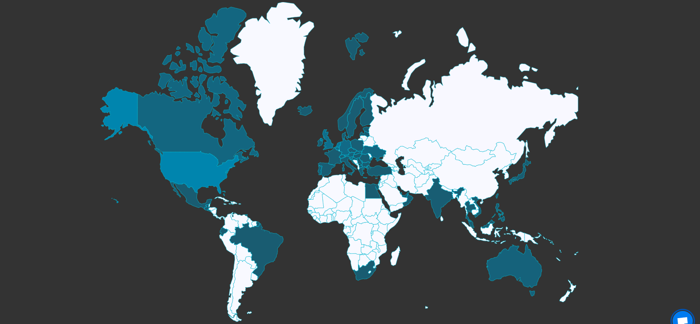
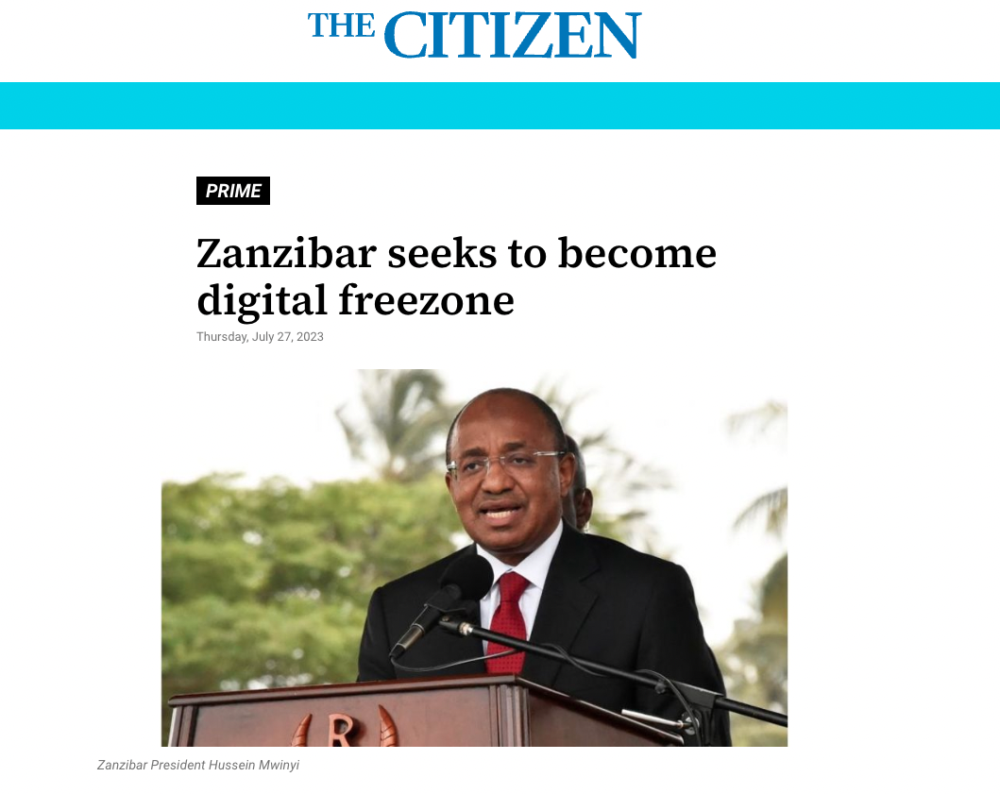
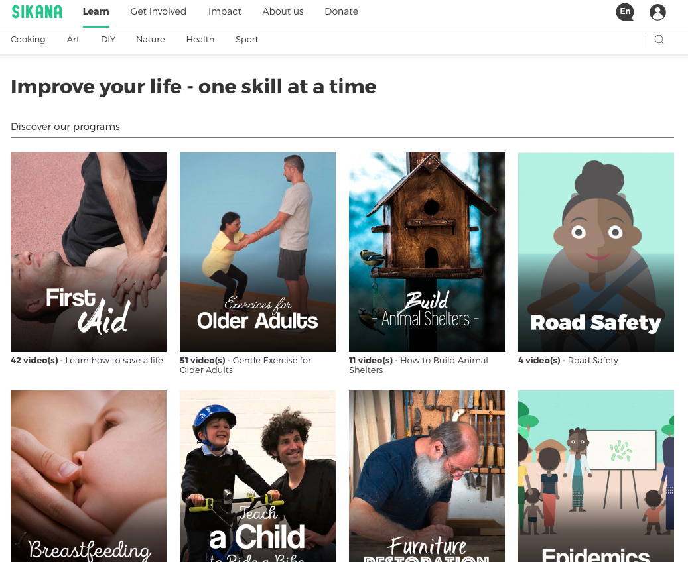

# What Has Been Achieved Already?

## ThreeFold

* ThreeFold Grid (a deployment of this technology in an open source model) and is active for years, also in generation 3, every day the community is adding capacity and using it (see [https://dashboard.grid.tf/explorer/statistics](https://dashboard.grid.tf/explorer/statistics) ). The community invested more than 30m USD.
* ThreeFold has developed all the technology required for an upgraded Internet and is now in generation 3.
* We signed heads of agreement with the Zanzibar government for a Digital Free Zone using our technology and another government will follow in H1 2023 (+60m people) for a new Internet and digital backbone.
* We are finalizing our 3Bot and Web3 Gateway, streamlining the process for developers to create influential decentralized applications with minimal effort while ensuring greater privacy and security for end users.

# Zanzibar Digital Freezone and Sustainable Regenerative City

<table>
  <tr>
   <td>OurWorld Venture Creator owns

60% of a Digital Sovereign Freezone.

Probably the first one in the world with

following incredible features:

- we are the regulator

- tax & corporate sovereignty

- full dispute resolution

- legal independence

- still connected & compatible 

   with the commonwealth system
   </td>
   <td>

   </td>
  </tr>
  <tr>
   <td>OurWorld Venture Creator owns

60% of a Charter City Project

1,000,000 m2 in Zanzibar

+ new Internet System for the Country

- linked to freezone

- launch 2024

- goal, bring thousands of changemakers

  to a regenerative city to create an 

  antidote for what is going wrong in

  the world (energy, internet, medical,

  food production, education, …)

    Show: living in a community healthy, sustainable, happy, in full abundance is possible.
   </td>
   <td>

   </td>
  </tr>
</table>

## Sikana

<table>
  <tr>
   <td>OurWorld Venture Creator owns

100% of Sikana

A peer2peer education video platform

extending to e-health

- +2,200 education videos

- +4 billion views

- +4 million subscribers

- +100 connected organizations
   </td>
   <td>

   </td>
  </tr>
</table>