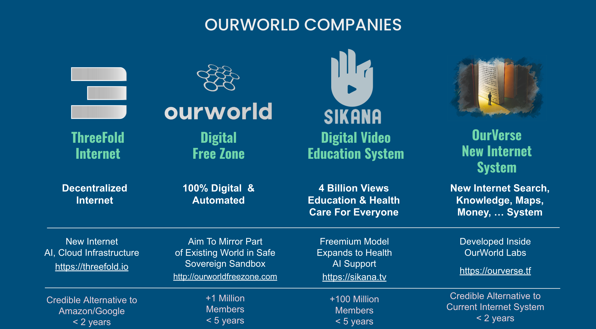

## Funding Round

ThreeFold and OurWorld have been created and grown by an experienced team who had great successes before. Our previous venture creator (called Incubaid, see [www.incubaid.com](http://www.incubaid.com) ) generated a 10x average return for our investors and had +600 million USD exits. OurWorld Venture Creator is the next iteration of Incubaid. 

OurWorld Venture Creator’s exit strategy is based on maximizing value through its holdings of shares in its multiple startups and Daughter Venture Creators. 

We want to offer investors a diversified risk profile and significant growth potential.

Furthermore, investors will also have the option to participate directly in each of the underlying projects. OurWorld Venture Creator is located in Mauritius, a stable and well-regulated location that provides additional protection for investors.

