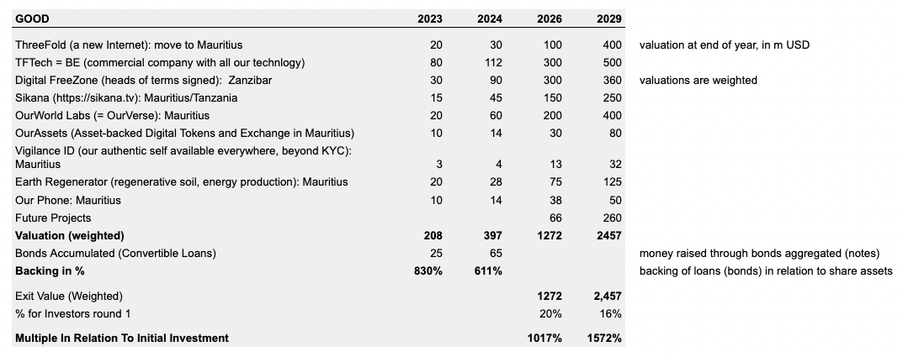
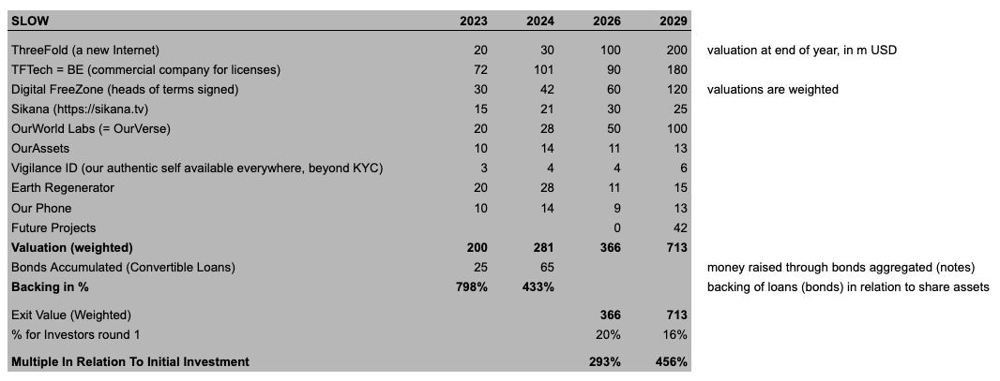
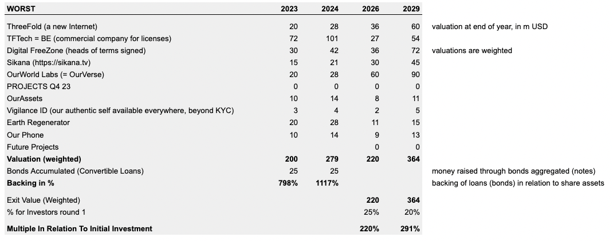

## Valuation & Backing Simulation

We believe that our projects have the potential to achieve a good valuation and serve different purposes and structures, providing a sound opportunity for risk diversification.

Currently, the financial world is facing significant challenges. We believe that, by investing in OurWorld Venture Creator as a tokenized bond that can be converted into either of our projects, we have a flexible investment instrument with several advantages, including:

* The potential for significant growth is high. The technology is impressive and the projects in the OurWorld Venture Creator will prove very valuable with high growth potential and a real purpose.
* The downside risk is limited, the backing assets are our shares in our startups and we anticipate the sum of our startups to always be worth more than the bonds we have given out.
* Optionally the price of the bonds can be tied to the value of gold. This means that instead of purchasing physical gold, the investor can obtain the same level of protection while still having the potential for profit associated with share ownership. 
* Investors have the flexibility to choose which organization to invest in when they convert their loan to shares.
* Mauritius is internationally recognized as a secure and well-governed jurisdiction.

The multiple as specified is a simulation if the investor would convert to shares at the Venture Creator level and the share percentage would be 20%. The weighted exit value is potential value which we believe we can create taking weights into consideration.

Above tables show how the venture creator structure allows the bonds to always be backed by the aggregated value of the ventures. The investors can choose when and if they want to convert their bonds to shares of any of the startups. In the appendix you can find a more detailed simulation of the “good” case.

_DISCLAIMER: The simulation provided is for informational purposes only and is not intended to provide specific financial or investment advice. It is presented as is, without any warranty of any kind, either express or implied._