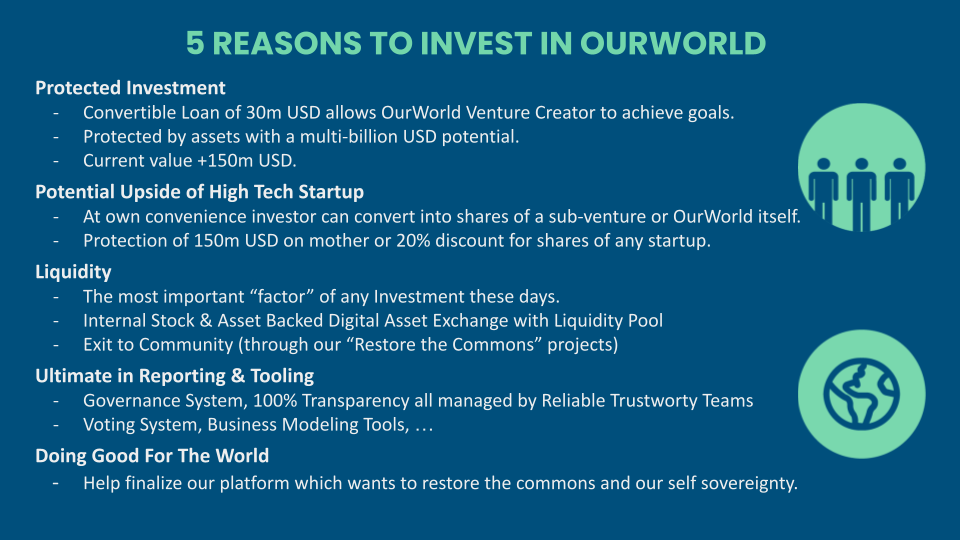

## Current Fundraise Terms

We fundraise upto 30m EUR at the OurWorld Venture Creator level, as convertible loan or tokenized bond. Investors have the option to convert the bonds into shares at a 20% discount of the pricing of the next funding round in the Venture Creator or any of the startups from the Venture Creator. 

There is also a protection mechanism for the investors if they convert into OurWorld Venture Creator, this means if they convert the valuation is 20% on next round with a maximum of 150m USD.