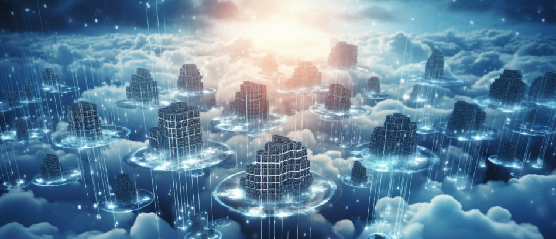
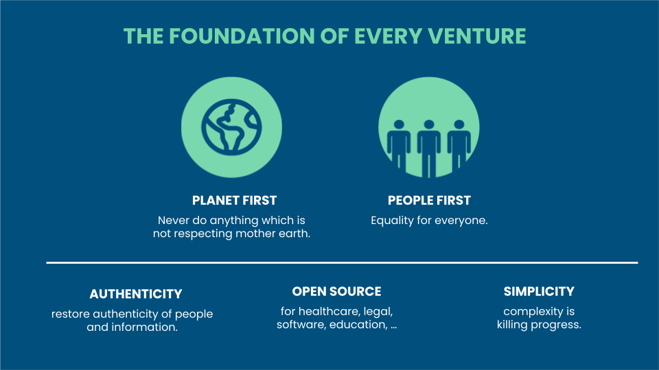

# OurWorld Venture Creator Experience

**We love building companies:**
- our previous Venture Creator was based in Belgium and was focused on creating meaningful technology for the Internet and Cloud. Some of the technologies created are still used today as products inside large companies like Verizon, Symantec and Western Digital.

**OurWorld Venture Creator believes doing well and doing good go together.**
- We are focused on creating technology which helps regenerate the planet and helps raise consciousness. We believe a new type of Internet needs to be created which provides equal chances for everyone and battles corruption while providing new opportunities.

**50M already invested**
- We are grateful that our community, founders and investors have invested +50m USD
- including $30m as community funding for the ThreeFold Internet System.

**We are looking for value added and value-aligned investors.**

## Experience 

Our team is behind some of the world’s most advanced Internet storage and cloud automation technologies. 

> **We have realized +600m $USD in exits with less than 60m $USD in funding.**

## Our Goals

1. To rollout a regeneratieve, ultra secure, reliable and **sovereign** Internet and Communication infrastructure. This includes AI infrastructure, telecom, storage, compute and more. Allow countries to own their own Internet.
2. To empower individuals and communities with the digital tools and capabilities they need to achieve a sovereign and prosperous economy through e-commerce, e-education, e-health.
3. To build an Earth Regenerator that provides energy and soil regeneration capabilities capable of decarbonizing the planet as well as helping to reverse desertification (phase 2).
4. Build new ways to produce Healthy Food and Clean Water (phase 2).
5. To establish, together with partners, a sovereign, secure, decentralized digital financial ecosystem that provides safe and affordable micropayments, exchanges, and digital currency systems.

## Our Core Values

1. Planet First
   * The health of our planet cannot be ignored
   * Every action we do as a group needs to have the best interests for our planet
2. People First
   * Every action needs to be in the best interest of our citizens
   * Safety, equality, education, health, privacy and sovereignty are all human right \