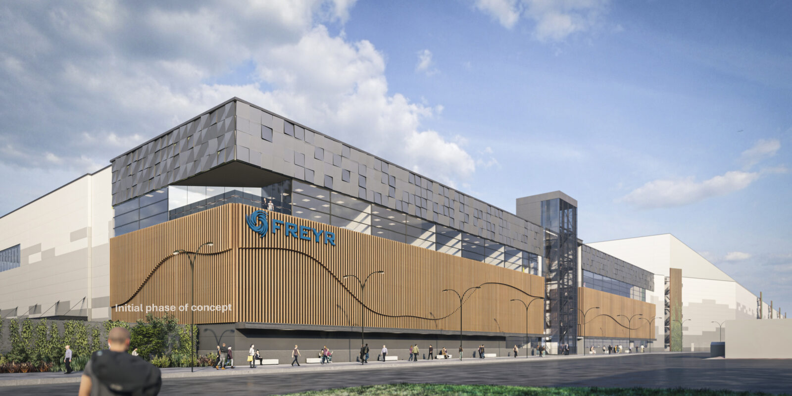

# Freyr Batteries

FREYR offers a clean Nordic solution to the rapidly growing global demand for high-density and cost-competitive battery cells for stationary energy storage (ESS), electric mobility, and marine applications.

Freyr is targeting the production of environmentally friendly battery cells through a business model intended to maximize long-term value creation.

> TODO: explain how we work together for delivery of Tier-S Datacentesr
> 