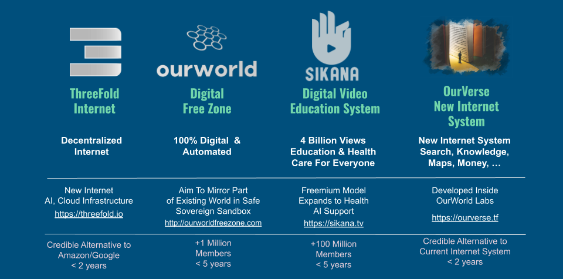
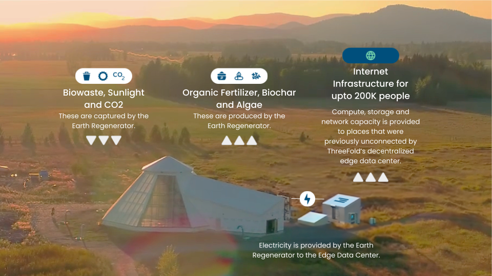

# 3-Fold Approach

In this section we describe how we can together create this OurWorld OS.

### A Mother Venture Creator = mechanism to fund and create startups which provide the initial building blocks

We have created a Mother Venture Creator called OurWorld in Mauritius which creates and empowers startups who invent, create and maintain the initial bootstrap components as needed for the OurWorld OS. 

**_4 Initial Projects_**

Read more in [http://info007.venturecreator.org](http://info007.venturecreator.org)  

### Daughter Venture Creators = expansion mechanism to help communities and countries to be sovereign

The Mother Venture Creator will help establish Daughter Venture Creators who help specific communities or countries to provide for their own future. Each Daughter Venture Creator has unlimited access to all technology as provided by the Mother Venture Creator. 

Each Daughter Venture Creator 

* works with a country or community to be most effective and achieve required results fast
* creates/empowers startups for all required innovations and customizations
* helps to establish below described “Commons” based Utility Providing Projects. 
* finds funding to make it all happen
* work on education projects together with schools and universities to make the knowledge stick
* makes sure all projects will endorse our values:  Planet and People First, Simplicity and Authenticity. 

We are creating a first Daughter Venture Creator in Zanzibar. Each Daughter can operate completely independently and autonomous but collaboration on a global scale is a requirement to provide global results faster.

There are 2 other Daughter Venture Creators close to being established.

### “Commons” based Utility Providing Projects = deploy the technology

Commons Based Utility projects are created by a Venture Creator and funded by Investors.

Example Commons Based Utility projects, provide for Clean Energy, Safe Internet Capacity, Earth Regeneration, Organic Food, Agriculture of and for the future, Clean Water, better Education and Health. 

We are working with partners to structure vehicles that could mobilize billions of USD for these  “Commons” based projects. 

Once the projects are operational and providing return, community owned Cooperative structures can buy back the shares of these projects as well as from our Venture Creators.

_This is an example of a commons based project where we provide a full blown circular solution to a community. Such a solution will exit to community while being operational._