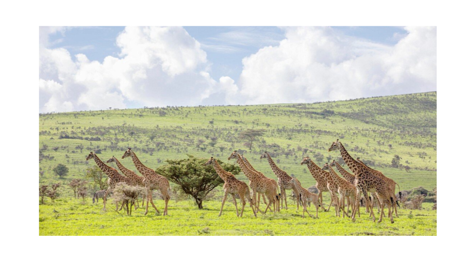

# Concrete Steps for building a conscious GLocal Community

The following steps try to give you an idea of what needs to be done to enable a community which operates at Global and Local level (GLocal). This serves as an example of how it can be done very concretely.

### A: Expand ThreeFold = a community owned internet - the physical layer 

There is an initial network build (see threefold), but each GLocal Community needs to have their own internet and digital backbone on which they can create their future. Such an internet for a community we call an OurVerse. All the OurVerses freely interconnect to each other making up the OmniVerse.

With only 10.000 nodes there is enough capacity to enable more than 1 million of people, ofcourse much smaller environments can be built. The standard nodes are sold through the community, each costs between 1,000 and 2,000 USD, the super nodes cost around 20-50k per super node.

There is a good economical incentive system built in to make sure that all participants can do good and well at the same time. We expect this process to take about one year from the start.

### B: Deploy the first version of Our Digital Twin (also called 3Bot)

Imagine a world where every person is represented by an autonomous digital assistant. Your digital twin lives inside our complementary decentralized Internet which we call Ourverse. 

Your Twin is very smart and manages all your data. Your data can never be lost nor corrupted. No-one can get access to your data without your permission, not even a quantum computer. Your Twin is alive 24 hours a day and knows how to represent you for all your digital and web needs. Your Twin organizes your agenda, communicates on your behalf, can make payments, can arrange your travel, can find information, can promote, sell and buy products and services everywhere in the world…

All the core components are done, we need to do the integration and localization. A User Interface needs to be created suitable for your community and lots of documentation and tutorials probably in multiple languages.

We expect this process for an initial good enough version to take about one year from the start and in parallel with step A and B.

This initial version will have at least following capabilities

* Communicate freely in all authenticity
* Find and Publish any information (again in all authenticity)
* Collaborate (on documents, information, …)
* Work with Digital Safe Currencies
* Do e-commerce between all members of OurVerse (sell, buy, trade, exchange) \

### C: AI for Good

AI is one of the most exciting and scary technologies ever invented, we can’t ignore nor put it back in Pandora's box. The only way forward is to endorse it but change the way it's being deployed, owned and used. We need a more conscious AI which is co-owned by all of us. 

There are plenty of opensource projects which are becoming good enough,  we need to help make them available in a decentralized manner on top of the ThreeFold Internet.

* Better search (planet/people first) & knowledge distribution
* Automatic Translation Services
* Automatic transcoding services (audio to text)
* Coding help
* Content creation 

These capabilities are needed to unlock the vaste information which is available on the internet.

### D: Populate OurVerse (our Internet) with all required information.

There is lots of information available on the current internet, lots of this information carefully needs to be farmed and stored in such a way it cannot be corrupted, can be searched, translated and distributed to all who need access to it. 

We expect to have to store more than 50 petabytes of information. Depending on the community, information might be different. As part of this process we will enable hundreds of people to execute on this work which has some manual steps as part of it.

We expect the initial process to take about one year from the start and in parallel with step A, B and C. This won't be the complete set yet but good enough to show the added value of what can be accomplished.

### E: An upgraded financial “eco” system

We have developed a set of tools to extend the Web3 ecosystem with following benefits:

* Scales to millions of transactions per second at lowest possible cost
* Exchange and asset to any other assets (money to service, money to money, service to good, …)
* Ability to transact (sell, buy, exchange, trade) even when the internet is slow or not available.
* A trust based system (proof of authenticity and identity)
* 100% compatible with the existing systems (existing regulatory and financial systems)
* Ability to co-own, co-finance projects (even with thousands of people).

As a point of reference our complementary peer2peer technology allows us to store the active financial information of 100 million people on the physical space of a coin, this allows for a lot of use cases which were not possible before.

We have all the underlying components done, we need about a year for finishing and testing this system on a larger scale. This too can be done in parallel with the above steps.

### F: Sovereignty for everyone, no matter where you live.

We are working on a project to allow almost everyone to achieve true legal and financial sovereignty, no matter where you live. This will be an incredibly powerful concept allowing us to truly create our future in all safety and equality. This system will be affordable for all of us. 

This is realized by a digital FreeZone which is in the process of being established.

### G: A Funding Mechanism and legal Structure to allow each community to create their own Super APP

Every community needs their own super app which allows them to communicate and collaborate around their common interests and goals. Creating such a super app today is expensive and complicated. It's also very difficult to get enough sovereignty and find a sound legal structure to make it happen.

We believe we have found a mechanism which achieves following almost impossible requirements

* A practical way how to get funding from your community in a way it's not seen as charity
* A more easy and efficient way to create all the tools and features you want together with your community and funded by your community.
* Tools which respect privacy and sovereignty of your community. Tools which are more secure. 
* Legal and Financial sovereignty to make sure you legally run your governance tools and financial treasury. A safe mechanism to work with digital currencies and do crowd funding. Both are extremely difficult to achieve today
* A mechanism which allows your community to co-own and co-invest in physical projects or assets.

### H: E-Health, E-Education, Earth Regeneration, Food Safety

More projects are cooking for our venture creator. As funding comes in these projects will reach enough maturity so they become available for everyone.