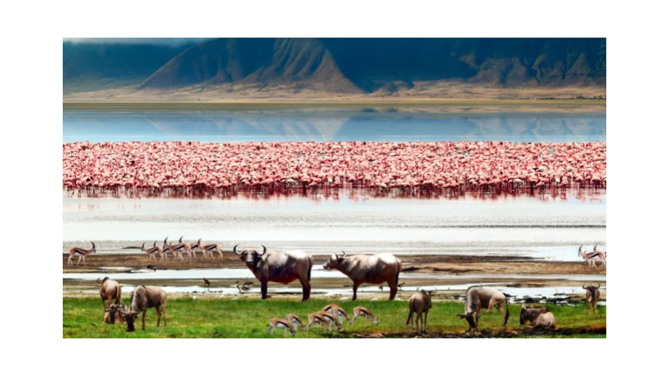

# OurWorld: “A set of Tools to restore The Commons” 

In a world where fear and greed prevail, we find ourselves in an incredibly exciting time where everything is possible. We believe that many of the challenges we face today, such as clean energy and water, combating desertification, waste repurposing, healthy living, CO2 sequestration, and sustainable lifestyles, have already been resolved. 

However, due to the influence of fear and greed, these much-needed innovations don’t find their way to market in an abundance-based way. We believe there are more than enough resources available in the world to allow everyone to have a prosperous and meaningful life. 

Can you imagine a world where:

* everyone has access to healthy food and medicine?
* everyone has endless opportunities to learn and be creative?
* no-one needs to live in fear, but we all learn to trust each other again?
* money is a beautiful source of energy which allows us to create a better world together? 
* we no longer have to depend on centralized services which are taking advantage of our data and manipulating our information?

We believe that a big part of the solution is to help people to reconnect with nature, culture and their beautiful self. There is so much we can learn from nature, how to grow, nurture and heal ourselves. Animals and plants know how to collaborate and be respectful of the environment they live in. For everything we do we want to learn from nature. This concept is called BioMimicry.

Another part is to restore respect for “The Commons”, which refers to resources that belong to or affect the whole of a community. These resources are collectively owned or shared between or among populations. These resources are said to be "held in common" and can include everything from natural resources and common land to software that is open for all to use.

We have created a methodology and tools to help restore the power of “The Commons”, we call this tool the OurWorld Operating System (OS).