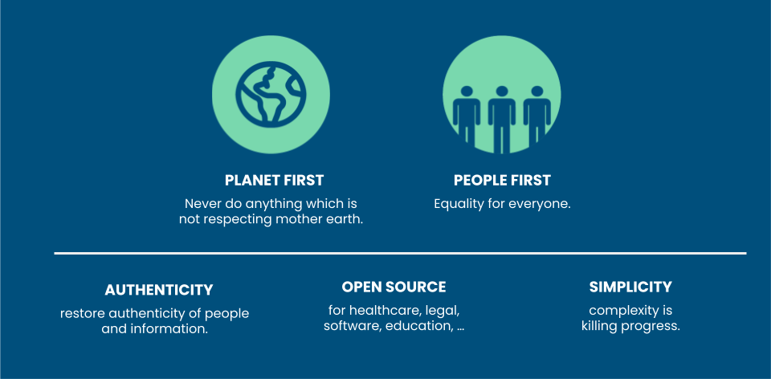

# Requirements for OurWorld OS

Together we have an amazing opportunity to create a Conscious Operating System for Humanity which we call OurWorld OS, not as a global centralized system but as a networked community driven mycelium of knowledge and collaboration achieving the goals as set before.

## Requirements

* planet & people first
* authentic 
* opensource solutions kept as simple as they can be to achieve required results
* fully decentralized, no middle man, networked to all parts of the world, unstoppable
* balance between information and guidance coming from the inner self versus outside
* creativity, joy and art is a fundamental part of our journey \