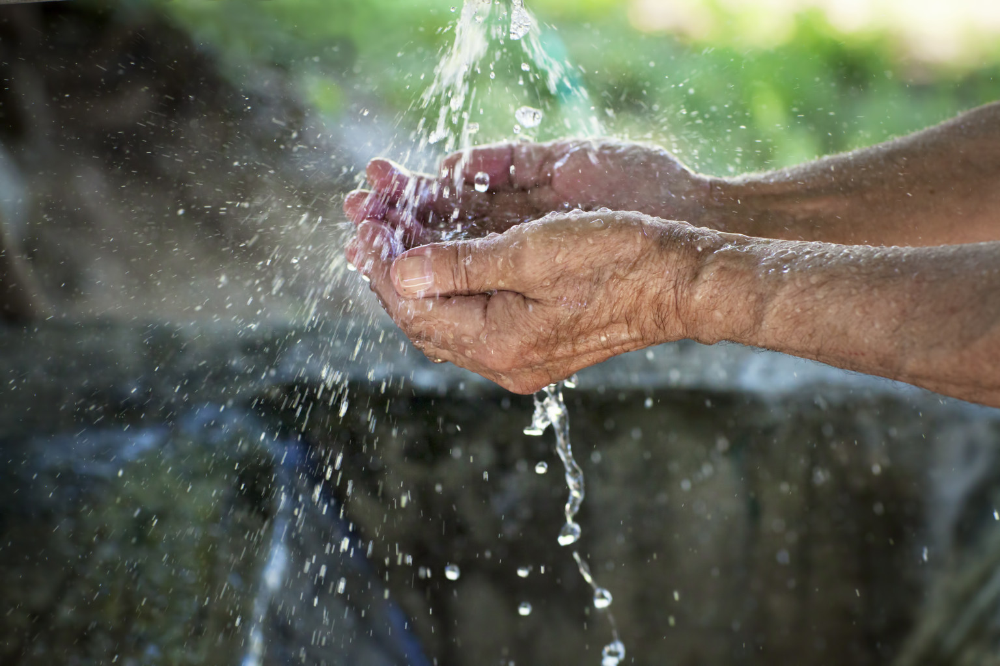

# Universal Access to Pure Water

Universal access to water is a crucial goal, embodying the idea that every individual should have access to water that is not only abundant but also of the highest quality. Ideal drinking water is locally sourced, ensuring minimal environmental impact and freshness. It should be pure, free from contaminants, and have a balanced pH and mineral composition to promote health and well-being. Sustainable practices in water production and distribution are vital to preserve our planet for future generations.

To realize this vision, innovative solutions are essential. One such partner contributing to this goal is [WayOut](https://wayout.com/), which has developed a system capable of producing up to 20,000 liters of perfect drinking water per day. This system aligns with the principles of local sourcing, purity, sustainability, and accessibility, thereby supporting the global shift towards a cleaner, healthier, and safer future.
