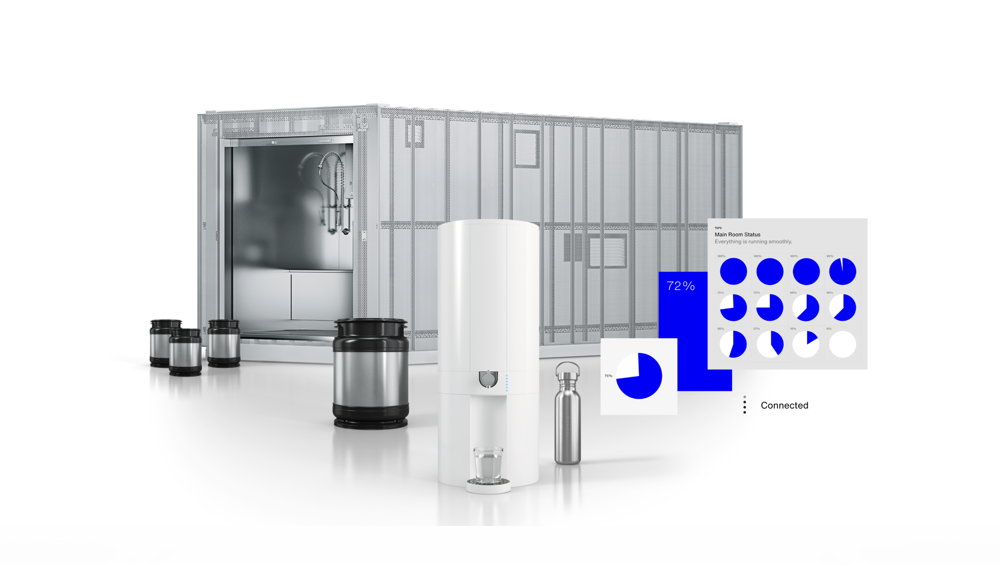

# Universal Access to Pure Water

The pursuit of universal access to water is more than a mere objective; it's a commitment to ensuring that every person on Earth has the right to clean, safe, and sustainable water. This vision goes beyond the mere availability of water; it encompasses the quality and source of water, ensuring it's pure, locally sourced, and sustainable in its production and distribution.

Water, being fundamental to life, should not be a luxury or a challenge to obtain. It needs to be accessible to all, regardless of geography or economic status. Perfect drinking water should come from a source that respects the environment, using methods that minimize carbon footprints and promote eco-friendly practices. It should be free from harmful contaminants, and its mineral balance should be maintained to support human health.

In this context, innovative solutions like those offered by WayOut are pivotal. [WayOut](https://wayout.com/)'s system, capable of producing up to 20,000 liters of high-quality water per day, demonstrates how technology can align with the ideals of sustainability, purity, and local sourcing. Such solutions are key to overcoming the global water crisis, ensuring that access to water is not a privilege, but a universal right. With such technologies and a global commitment to sustainable practices, the world can move towards a future where clean, safe water is a given for everyone, everywhere.

The WayOut water system is an innovative solution for producing clean, sustainable drinking water. Here's how it works:

- **Modular Production System**: The system can clean any source of water, making it safe for drinking and cooking. Each micro-factory is built locally, reducing transport costs and parts required.
- **Treatment Process**: It uses a 12-step process for water treatment, including techniques such as sand filtration, reverse osmosis, and ultraviolet disinfection. This process not only cleans the water but also remineralizes it.
- **Capacity**: A standard system in a container can produce up to 20,000 liters of water per day, enough for 10,000 people. Smaller units can supply 8,000 liters of clean water a day, sufficient for 2,000 people.
- **Sustainability**: The system can operate off-grid using renewable energy and is designed to replace single-use plastic bottles. Water is stored in smart stainless-steel kegs with digital chips that monitor the water's healthfulness.
- **Digital Integration**: Taps on the system are connected to the cloud, allowing owners to understand usage patterns and manage demand. The system includes a digital dashboard for real-time monitoring and control.
- **Containerized System**: It's a plug-and-play system, with the containerized treatment train including filters, ion exchange, and UV disinfection. The system is divided into a treatment area and an operator area.
- **Water Dispensation**: Clean water is transferred into metallic kegs and delivered to customers. The kegs are cleaned with ozone and are used for water transport.

This system aims to bring control of clean water sources into communities, improving local health and reducing reliance on plastic bottles.
