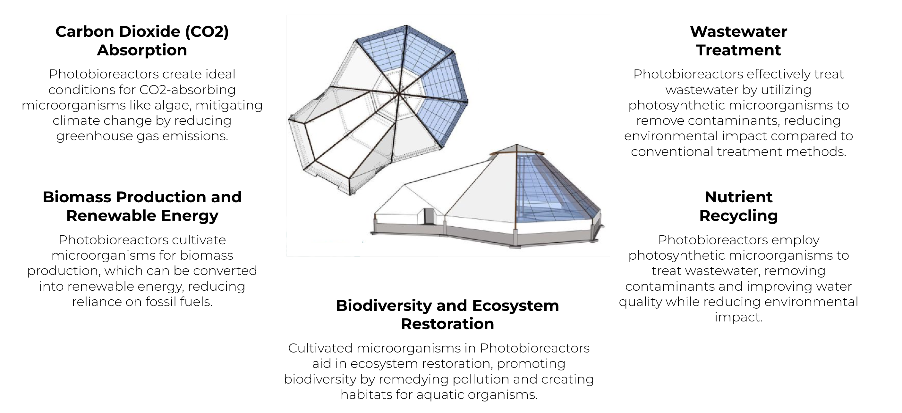

# Regenerating our Soil

Healthy soil is the foundation of sustainable agriculture and a critical component of our ecosystem. The mission of regenerating the soil goes beyond simply improving agricultural output; it's about restoring and maintaining the health of soil ecosystems worldwide. This vision encompasses not only the productivity of the soil but also its role in supporting biodiversity, sequestering carbon, and maintaining water cycles.

Soil regeneration is essential for sustaining life on Earth. It shouldn't be viewed as a challenge limited to farmers or environmentalists, but as a collective responsibility. The ideal regenerative soil management practices respect the natural balance, utilizing methods that enhance soil health, promote biodiversity, and reduce the impact on the environment.

In this context, technological innovations like "The Earth Regenerator" are vital. These technologies demonstrate how we can align agricultural practices with ecological sustainability, ensuring that soil health is not just preserved but actively improved.

## The Earth Regenerator: A Technological Solution for Soil Regeneration

- **Modular Regeneration System**: "The Earth Regenerator" system is capable of enhancing soil quality across various environments. Each module is designed to adapt to local soil conditions, maximizing its regenerative capacity.
- **Regeneration Process**: Utilizes advanced methods like biochar incorporation, organic matter enrichment, and microbial habitat improvement to rejuvenate the soil.
- **Capacity and Coverage**: Designed to cater to diverse land sizes, from small farms to larger agricultural fields, enhancing soil health across different ecosystems.
- **Sustainability and Eco-friendliness**: Operates on sustainable principles, focusing on natural processes and minimizing the use of synthetic inputs. The system contributes to reducing carbon footprint and promotes eco-friendly soil management.
- **Digital Integration and Monitoring**: Equipped with smart technology for soil monitoring and data analytics, enabling farmers and land managers to track soil health and make informed decisions.
- **Ease of Implementation**: The system is user-friendly and can be integrated into existing agricultural practices without significant disruption.
- **Community Empowerment**: By improving soil health, the system aims to empower local communities, ensuring food security, and promoting sustainable agricultural practices.
  
"The Earth Regenerator" is more than a technological solution; it's a step towards a future where the health of the soil and the ecosystem is a priority, ensuring sustainable and productive agriculture for generations to come.

