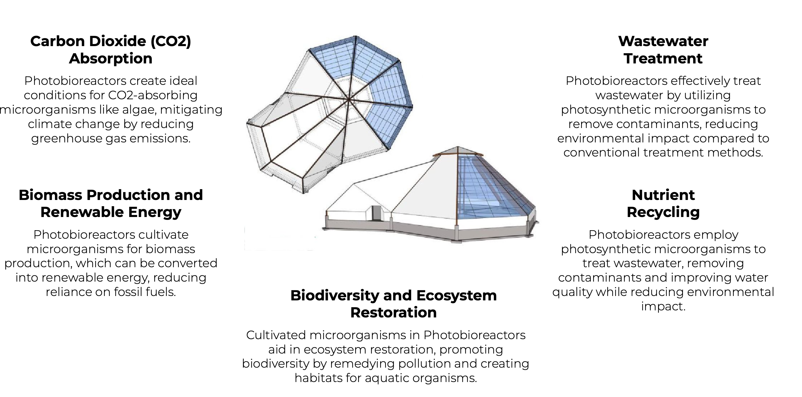

# Earth Regenerator

## Why: Addressing Environmental Challenges 

The Earth Regenerator addresses critical environmental challenges that our planet faces today. Excessive CO2 emissions, reliance on chemical fertilizers and fossil fuels, nutrient waste, and ecosystem degradation pose significant threats to the Earth's health. These issues require innovative solutions to restore balance and sustainability to our environment.

## How: Utilizing Photobioreactor Technology

The solution lies in the advanced use of photobioreactor technology. Photobioreactors are systems that provide a controlled environment for the efficient growth of algae or other photosynthetic organisms. These systems absorb CO2 and can produce high amounts of biofertilizers and biomass. The biomass generated is a renewable energy source, contributing to environmental restoration and the reduction of fossil fuel dependence.

## What: Earth Regenerator's Multifaceted Approach

The Earth Regenerator takes a multifaceted approach:

- **Environmental Restoration**: By absorbing CO2 and producing biofertilizers, it contributes significantly to environmental healing.
- **Renewable Energy Production**: The biomass produced is used for generating renewable energy, aligning with global sustainability goals.
- **Open Source Business Model**: All technology, software, and knowledge related to the Earth Regenerator are open-source. Commercial licenses generate revenue, with the return on investment for the first bioreactor achieved in under two years.
- **Market and Differentiator**: The Earth Regenerator appeals to markets such as sovereign funds and the carbon market. Its high ROI model and multiple revenue streams set it apart from other bioreactor technologies.
- **Status**: The technology is already in existence with proof of concept completed. The venture is currently awaiting additional funding to build a team and commercialize the technology further.

This venture represents a step towards a more sustainable and environmentally conscious future, offering a promising solution to some of the most pressing environmental issues of our time.
