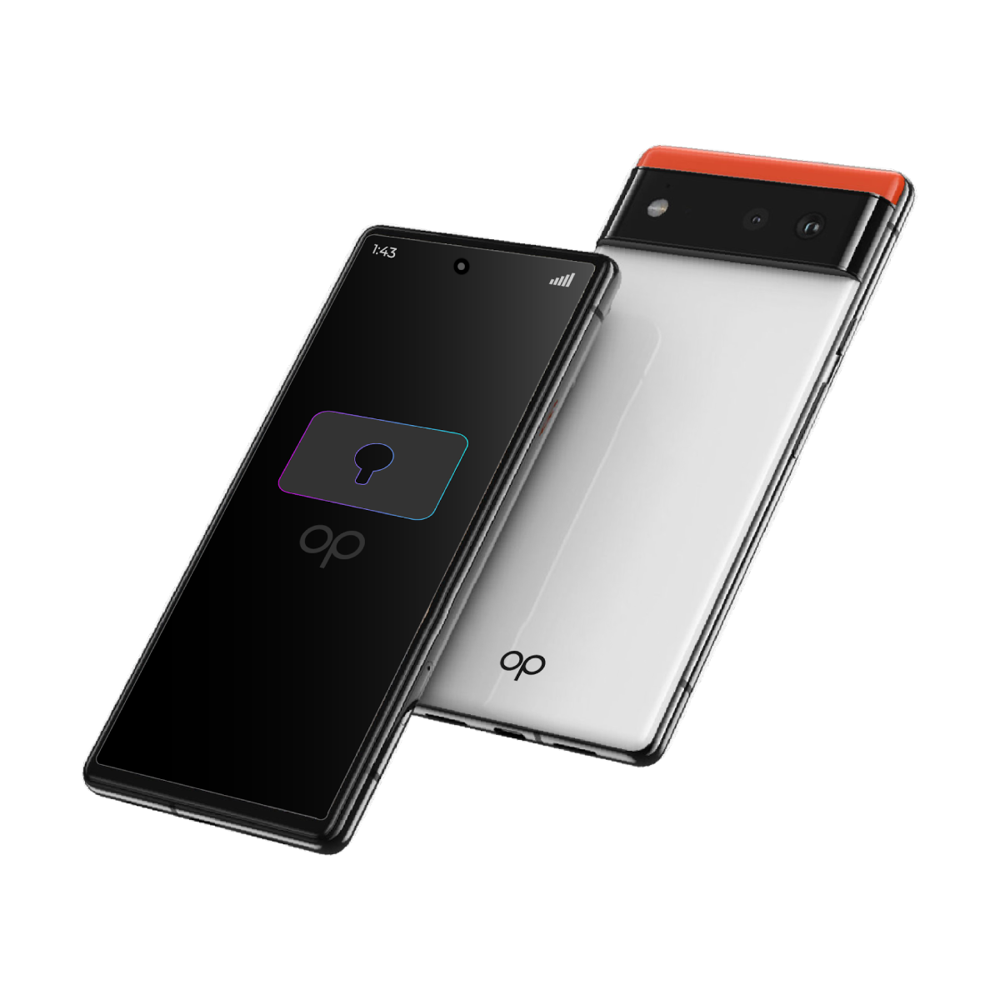
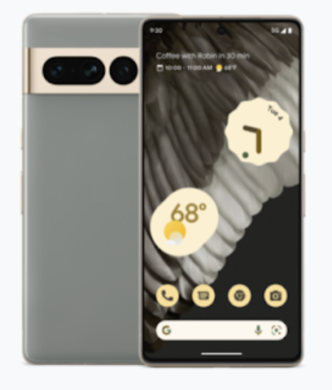
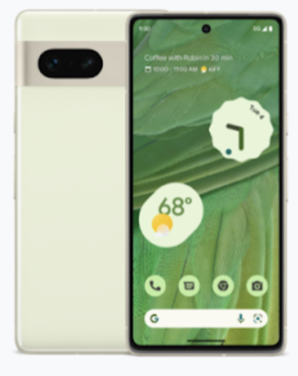
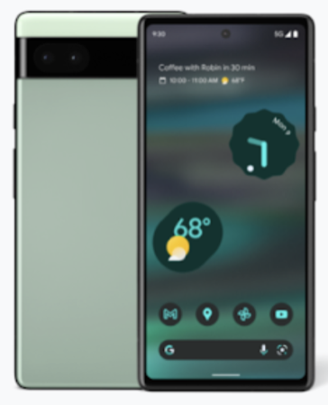

# OurPhone

## Venture Highlights

- **Overview**: OurPhone is a pioneering ultra-secure mobile solution, offering unparalleled data protection and privacy.
- **Mission**: To empower users with a secure and private mobile communication experience, enhancing data protection in the digital age.
- **Problem**: The modern digital landscape is rife with privacy concerns, as conventional phones and applications compromise user data security and sovereignty. 
- **Market Opportunity**: Rapidly growing security-conscious individuals and organizations who prioritize privacy and data security in their mobile communications.
- **Products and Services**: Secure smartphones equipped with advanced privacy features, including encrypted communication systems, private cloud services, personal browsers, and more.
- **Stage of Developmen**t: The product specifications and features have been tested, with plans underway for a crowdfunding campaign and subsequent commercial launch.
- **Key Differentiators:** Offers superior security features typically found in high-cost devices, making advanced privacy accessible to a wider audience. Unique in its focus on decentralization and user sovereignty.
- **Business Model**: OurPhone offers three phone categories priced between $500-$1200, with a 20-30% margin on the phone, and recurring monthly fees of $20 per person per month.

## Why: Addressing the Loss of Data Sovereignty

OurPhone emerges as a solution to the pervasive problem in today's digital landscape where phones and applications are incessantly gathering user information, leading to a loss of data sovereignty. This issue is a growing concern, especially for security-conscious organizations and individuals who recognize the urgent need for advanced data protection in mobile communication.

## How: Affordable, Ultra-Secure Phone Solution

A phone with cutting-edge security and privacy features combined with self-sovereign chat, video conferencing, personal cloud, private browser, social media and more.

OurPhone offers an ultra-secure mobile device that ensures unmatched data protection. It is powered by Graphene OS, a private and secure Android-compatible mobile operating system, and supported by ThreeFold's decentralized and self-sovereign cloud platform. This combination allows OurPhone to enhance the security and privacy of every application. Features include:

- Graphene OS: GrapheneOS improves the privacy and security of the OS from the bottom up. It deploys technologies to mitigate whole classes of vulnerabilities and make exploiting the most common sources of vulnerabilities substantially more difficult. It improves the security of both the OS and the apps running on it.
- Quantum Safe Cloud Storage: Ensures decentralized cloud storage, safeguarding data beyond current encryption standards​​.
- Mycelium Network: Hosted on the ThreeFold's end-to-end encrypted network, designed to find the shortest path between peers and nodes to   offer unparalleled security and privacy for user data​​.
- Edge Computing: Powered by the latest edge cloud technology for unmatched application performance​​.

## What: OurPhone Products

Experience true sovereignty at your fingertips with the world’s first truly decentralized smartphone.

|Model|OurPhone X|OurPhone Y|OurPhone A|
|---|---|---|---|
|||||
|Display|6.7-inch QHD+ Quad High Definition|6.3-inch FHD+ Full High Definition|6.1-inch FHD+ Full High Definition|
|Camera| Triple rear camera system: Wide, ultrawide, 2 telephoto lens|Dual rear camera system: Wide, ultrawide lens|Dual rear camera system:
Wide, ultrawide lens|
|Processor|Google Tensor G2|Google Tensor G2|Google Tensor|
|Memory|12Gb RAM|8Gb RAM|6Gb RAM|
|Battery|5000 mAh3, Fast wireless charging|4355 mAh3, Fast wireless charging|4410 mAh3|

OurPhone represents a significant advancement in smartphone technology, focusing on user sovereignty, data protection, and privacy. It stands out in the market for its innovative features and its commitment to providing a decentralized, secure, and user-centric mobile experience.

## More Info:

- Website: [ourphone.tf](https://ourphone.ourworld.tf)
