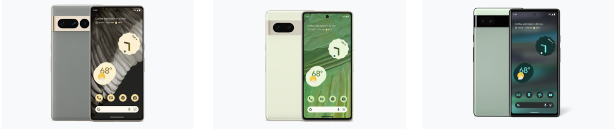

# OurPhone

## Why: Addressing the Loss of Data Sovereignty

OurPhone emerges as a solution to the pervasive problem in today's digital landscape where phones and applications are incessantly gathering user information, leading to a loss of data sovereignty. This issue is a growing concern, especially for security-conscious organizations and individuals who recognize the urgent need for advanced data protection in mobile communication.

## How: Leveraging Cutting-Edge Technology for Security and Privacy

A phone with cutting-edge security and privacy features combined with self-sovereign chat, video conferencing, personal cloud, private browser, social media and more.

OurPhone offers an ultra-secure mobile device that ensures unmatched data protection. It is powered by Graphene OS, a private and secure Android-compatible mobile operating system, and supported by ThreeFold's decentralized and self-sovereign cloud platform. This combination allows OurPhone to enhance the security and privacy of every application. Features include:

- Graphene OS: GrapheneOS improves the privacy and security of the OS from the bottom up. It deploys technologies to mitigate whole classes of vulnerabilities and make exploiting the most common sources of vulnerabilities substantially more difficult. It improves the security of both the OS and the apps running on it.
- Quantum Safe Cloud Storage: Ensures decentralized cloud storage, safeguarding data beyond current encryption standards​​.
- Mycelium Network: Hosted on the ThreeFold's end-to-end encrypted network, designed to find the shortest path between peers and nodes to   offer unparalleled security and privacy for user data​​.
- Edge Computing: Powered by the latest edge cloud technology for unmatched application performance​​.

## What: The OurPhone Offerings

Experience true sovereignty at your fingertips with the world’s first truly decentralized smartphone.

|Model|OurPhone X|OurPhone Y|OurPhone A|
|---|---|---|---|
|||||
|Display|6.7-inch QHD+ Quad High Definition|6.3-inch FHD+ Full High Definition|6.1-inch FHD+ Full High Definition|
|Camera|Triple rear camera system: Wide, ultrawide, 2 telephoto lens|Dual rear camera system: Wide, ultrawide lens|Dual rear camera system:
Wide, ultrawide lens|
|Processor|Google Tensor G2|Google Tensor G2|Google Tensor|
|Memory|12Gb RAM|8Gb RAM|6Gb RAM|
|Battery|5000 mAh3, Fast wireless charging|4355 mAh3, Fast wireless charging|4410 mAh3|

- Product Specifications: OurPhone models are based on Google Pixel 6a, 7, and 7 Pro, featuring Graphene OS, a secure network layer, and compatibility with Android apps. The phone also includes Digital Twin Technology, enhancing user experience​​.
- OurPhone X Model Specs: This model features a 6.7-inch QHD+ Quad High Definition display, a triple rear camera system, a Google Tensor G2 processor, 12Gb RAM, a 5000 mAh battery with fast wireless charging, and other advanced specifications​​​​.
- Business Model: OurPhone offers three phone categories priced between $500-$1200, with a 20-30% margin on the phone, and recurring monthly fees of $20 per person per month.
- Market and Differentiator: The primary market includes security-conscious organizations and individuals. The superior security features, traditionally found in high-cost devices, are now made accessible to a wider audience.
Current Status and Future Plans: The product specifications and features have been tested, and plans are underway for a crowdfunding campaign following funding.

OurPhone represents a significant advancement in smartphone technology, focusing on user sovereignty, data protection, and privacy. It stands out in the market for its innovative features and its commitment to providing a decentralized, secure, and user-centric mobile experience.

## More Info:

- Website: [ourphone.tf](https://ourphone.ourworld.tf)

- Overview: OurPhone is an ultra-secure mobile device, offering unmatched data protection and access to our full suite of solutions.
- Problem: Today’s phones and applications are designed to gather our information 24/7. We lost all sovereignty whatsoever.
- Solution: A phone with cutting-edge security and privacy features combined with self-sovereign chat, video conferencing, personal cloud, private browser, social media and more.
- Business model: 3 phone categories ($500-$1200) with 20-30% margin on phone, and recurring monthly fees of $20/ pp month.
- Market: Security-conscious organizations and individuals, recognizing the urgent need for advanced data protection in mobile communication.
- Differentiator: superior security features traditionally found in high-cost devices, now made accessible to a wider audience.
- Status: Product specifications and features have already been tested. Planning a crowdfunding campaign post funding.
