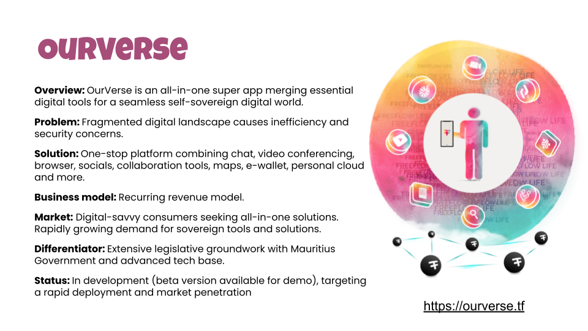

# OurVerse

## Why: Restoring Value and Access to Information

OurVerse addresses the critical need for free, convenient access to authentic information in a digital age often clouded by misinformation. It seeks to empower users to find and publish any information without fear of censorship, ensuring that the authenticity and value of information are preserved. This venture aims to revolutionize the way people interact with and trust digital content.

## How: Leveraging Decentralized Technology and AI

OurVerse is an all-in-one super app built on a foundation of decentralized and open-source infrastructures and AI, allowing for rapid and authentic access to information. It integrates advanced technologies like Proof-of-Authenticity and decentralized AI to enhance search efficiency and accuracy. The platform also supports various experiences, from maps to metaverse interfaces, ensuring a diverse and immersive information access experience.

## What: The OurVerse Offering

A better world is one where we all have access to endless information and oppurtunities. OurVerse exists to achieve that dream.

- **Easy Information & Web Publishing**: Users can publish a wide range of websites and web experiences, ensuring freedom of expression and dissemination of information.
- **Global Indexing & Search**: Features a global indexing system based on planet, people, and authenticity, enhancing the relevance and reliability of search results.
- **OurMaps**: An alternative to Google Maps, based on open maps but with a more decentralized approach.
- **Our MetaVerse**: Extends real-world experiences into the metaverse, integrating open-source partner solutions.
- **OurLibrary:** Offers access to petabytes of information, tailored for each community.
- **Resilience and Authenticity:** Works even during internet outages, provides faster searches with less manipulation, and ensures proof of authenticity.
- **Standard Integrations:** Compatible with protocols like Nostr and Activity Pub, fully integrated within the ThreeFold Grid, 3Bot, and other mentioned services.
- **Status**: While in development, OurVerse leverages its technology stack for speed and efficiency, awaiting further funding for general product availability.

OurVerse stands as a transformative venture in the digital world, offering a new paradigm in how we access, publish, and trust information. It embodies a future where information is not only freely accessible but also authenticated and diverse in its presentation, backed by a robust, decentralized technological framework.

Website: [ourverse.tf](https://ourverse.tf/)

Status: Not Yet Active

