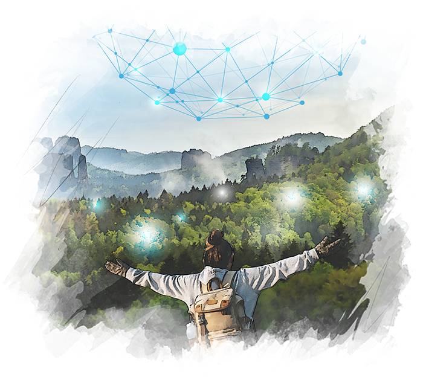

# OurVerse

## Venture Highlights

Overview: OurVerse is an all-encompassing digital platform that integrates various essential online tools and services, creating a unified digital experience.
Mission: To provide a seamless and sovereign digital world by merging key digital tools like chat, video conferencing, personal cloud, streaming, browsing, maps, and wallet into one super app.
Problem: The fragmentation of digital tools and services across multiple platforms, leading to inefficiencies and challenges in maintaining digital sovereignty and privacy.
Market Opportunity: Catering to the growing global demand for integrated digital solutions, particularly among internet users seeking a comprehensive and user-friendly digital environment.
Products and Services: A single platform offering a range of digital tools including chat, video conferencing, personal cloud, streaming services, a private browser, and more, with additional features like maps and a digital wallet.
Stage of Development: Currently in development, with plans for further expansion and enhancement of services upon securing additional funding.
Key Differentiators: Digital-savvy customers seeking for sovereign, secure and convenient all-in-one solutions. By uniquely combining a wide array of digital tools in a single platform, focusing on user sovereignty, privacy, and ease of use, OurVerse is geared to support the self-sovereign age.
Business Model: Currently undisclosed, likely to include a recurring revenue/ subscription model or monetization through integrated services.

## Why: Restoring Value and Access to Information

OurVerse addresses the critical need for free, convenient access to authentic information in a digital age often clouded by misinformation. It seeks to empower users to find and publish any information without fear of censorship, ensuring that the authenticity and value of information are preserved. This venture aims to revolutionize the way people interact with and trust digital content.

## How: Leveraging Decentralized Technology and AI

OurVerse is an all-in-one super app merging all essential digital tools (chat, video conferencing, personal cloud, streaming, browsing, maps, wallet and much more) for a seamless self-sovereign digital world, ensuring a diverse and immersive information access experience.

Built on a foundation of decentralized and open-source infrastructures, OurVerse allows for rapid and authentic access to information.  It integrates advanced technologies like Proof-of-Authenticity and decentralized AI to enhance search efficiency and accuracy. 

Thanks to it's open-source nature, OurVerse is compatible with most modern protocols like Nostr and Activity Pub, and can be fully integrated to technologies of the OurWorld ecosystem (ThreeFold Grid, Digital Twin, Mycelium, and more).

## What: The OurVerse Offering

A better world is one where we all have access to endless information and oppurtunities. OurVerse exists to achieve that dream. Features include: 

- **Easy Information & Web Publishing**: Users can publish a wide range of websites and web experiences, ensuring freedom of expression and dissemination of information.
- **Global Indexing & Search**: Features a global indexing system based on planet, people, and authenticity, enhancing the relevance and reliability of search results.
- **OurMaps**: An alternative to Google Maps, based on open maps but with a more decentralized approach.
- **Our MetaVerse**: Extends real-world experiences into the metaverse, integrating open-source partner solutions.
- **OurLibrary:** Offers access to petabytes of information, tailored for each community.
- **Resilience and Authenticity:** Works even during internet outages, provides faster searches with less manipulation, and ensures proof of authenticity.

OurVerse stands as a transformative venture in the digital world, offering a new paradigm in how we access, publish, and trust information. It embodies a future where information is not only freely accessible but also authenticated and diverse in its presentation, backed by a robust, decentralized technological framework.

## More Info:

- Website: [ourverse.tf](https://ourverse.tf/)

