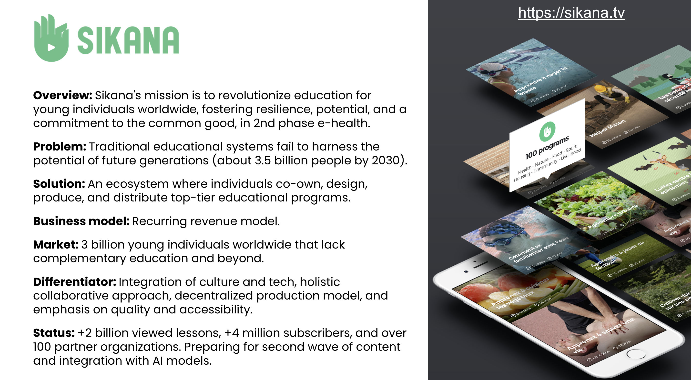

# Sikana

## Why: Transforming Education for Young Individuals

Sikana addresses the critical gap in traditional educational systems by aiming to revolutionize education for young individuals around the world. Recognizing that these systems often fail to harness the potential of future generations, Sikana's mission is to foster resilience, potential, and a commitment to the common good, particularly focusing on practical skills. This initiative is crucial as it targets about 3 billion people by 2030 who are in need of complementary education.

## How: Creating a Collaborative Educational Ecosystem

Sikana operates as an ecosystem where individuals co-own, design, produce, and distribute educational programs. This decentralized and collaborative approach ensures that the content is not only top-tier in terms of quality but also widely accessible. The integration of culture and technology, along with a holistic approach, forms the backbone of Sikana's methodology.

## What: Sikana's Offerings and Achievements

- Educational Video Programs: Sikana equips people with practical skills through free educational video programs, covering a diverse range of subjects.
- Business Model: Sikana operates on a recurring revenue model, ensuring sustainability and scalability of its educational offerings.
- Target Market: Targeting 3 billion young individuals worldwide who lack complementary education, with a focus on expanding into e-health.
- Differentiators: Sikana stands out through its integration of culture and tech, a holistic and collaborative approach, a decentralized production model, and a strong emphasis on quality and accessibility.
- Current Status and Future Plans: With over 2 billion viewed lessons, more than 4 million subscribers, and over 100 partner organizations, Sikana is preparing for a second wave of content and integration with AI models. This next phase is poised to further enhance the educational impact and reach of the platform, and will also include an e-health platform.

Sikana is a pioneering non-profit organization, active since 2014, that has made significant strides in redefining educational access and quality, particularly for young individuals across the globe. Its emphasis on practical skills and collaborative production sets a new standard in the realm of educational content delivery.

More info:

- Website: [sikana.tv](https://www.sikana.tv/en)
