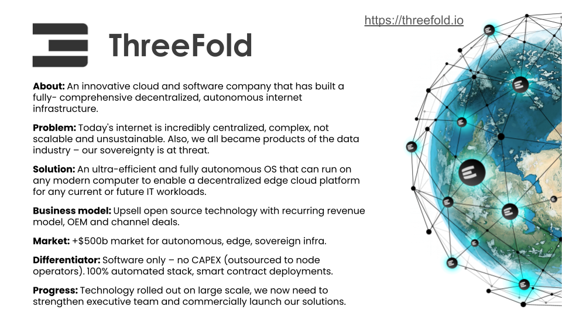

# ThreeFold

ThreeFold is a globally-distributed grid of storage, compute, and network capacity, acting as “no middleman” Internet resources between independent capacity providers and users.

Website: [threefold.io](https://threefold.io) 
Manual: [manual.grid.tf](https://manual.grid.tf) 
Capacity Explorer: [dashboard.grid.tf](https://dashboard.grid.tf/explorer/statistics)

Status: Active 
Launched: 2016

Today the ThreeFold Grid is live in more than 60 countries and in its third generation technology.

