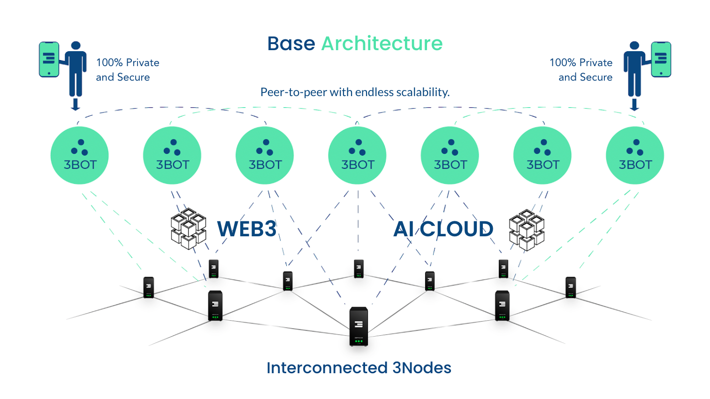

# ThreeFold Tech

## Why: Revolutionizing Internet Infrastructure for a Sustainable Future

TFTech is addressing the urgent need for a more sustainable, efficient, and autonomous internet infrastructure. With the global internet infrastructure market rapidly expanding and demanding energy-efficient features, TFTech recognizes the limitations of existing centralized, complex, and power-hungry solutions. Their revolutionary platform is poised to disrupt the market, catering to industries like AI, IoT, cloud computing, and autonomous vehicles, among others. This venture aims to enable a world where individuals and organizations can operate in a safe, sovereign, scalable, and energy-efficient digital environment, challenging the status quo of internet and cloud infrastructure.

## How: Laying out the foundation for a Truly Decentralized World 

ThreeFold Tech achieves its mission through a combination of advanced technology and innovative strategies, structured to create a decentralized and sustainable cloud computing environment. The core of their approach involves:

- **100% Autonomous IT**: At the core of ThreeFold Tech's approach is the development of an operating system and infrastructure that are entirely self-operating and self-healing. This autonomy is a game-changer, as it removes the need for human intervention, thereby enhancing security and operational efficiency. The ability of the system to manage and repair itself ensures a more reliable and secure cloud infrastructure.
- **Hyper-Scalability**: ThreeFold Tech's platform is uniquely designed for hyper-scalability. It is capable of scaling up internet infrastructure in any location where electricity and network access are available. This design not only offers significant cost savings but also provides unparalleled flexibility in deployment. The scalability factor is crucial for adapting to varying demand and for expanding services in diverse geographical regions.
- **Ultra-Sustainability**: Sustainability is woven into every aspect of ThreeFold Tech's technology. From the ground up, the system is designed to reduce overheads significantly and extend the lifespan of hardware components. This commitment to sustainability is not just environmentally responsible but also economically advantageous, as it leads to lower operational costs over time. The focus on sustainability reflects a forward-thinking approach to technology development, aligning with global efforts to create more eco-friendly digital solutions.
- **Commitment to Open Source and Community**: Leveraging open-source principles, ThreeFold Tech underpins the ThreeFold Grid, a globally-distributed grid of independent storage, compute, and network capacity. This community-driven approach democratizes internet resources and encourages collaboration among users.

## What: Decentralized, Autonomous and Ultra-Efficient Internet Infrastructure Platform

ThreeFold Tech (TFTech) has developed a pioneering autonomous cloud platform that represents a significant advancement in cloud computing technology. The platform, which has been in development since 2016, is designed to offer optimal scalability, data protection, and efficiency. It is well-suited to address the challenges and demands of the modern IT industry while adhering to Environmental, Social, and Governance (ESG) standards.

The core of TFTech’s offering is its decentralized, edge autonomous infrastructure that is adaptable and capable of functioning on any modern computer with a network connection and electricity. This approach ensures 100% autonomy, hyper-scalability, and ultra-sustainability. The lightweight operating system is specifically designed to optimize hardware space for IT workloads. The platform includes:

- **Decentralized Autonomous OS**: Facilitates streamlined operations at the network's edge, running on any modern computer.
- **Quantum Safe Storage**: Offers an ultra-scalable and secure storage system, compatible with most tools and protocols.
- **Edge Cloud Computing Platform**: Provides a comprehensive and autonomous platform for a variety of IT workloads.
- **Mycelium Network**: Ensures fast and secure data transfers with end-to-end encryption.

These components enable smart-contract-enabled deployments, leading to significant energy savings of up to 90% and unparalleled security, a substantial improvement over traditional cloud models. Additionally, TFTech's open-source code is utilized by the [ThreeFold Grid](https://dashboard.grid.tf/explorer/statistics), a globally-distributed grid of storage, compute, and network capacity.

## More Info:

- Website: [threefold.io](https://threefold.io) 
- Manual: [manual.grid.tf](https://manual.grid.tf) 
- Capacity Explorer: [dashboard.grid.tf](https://dashboard.grid.tf/explorer/statistics)
