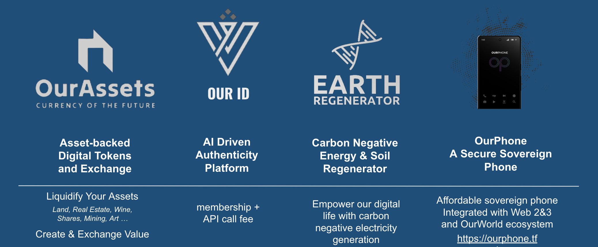

# OurWorld Ventures

Together we are creating a multi-faceted platform to support and empower startups aspiring to harness of emerging technology while putting the planet and people first.

Our current projects have concrete potential to bring true sovereignty to all of us.

## OurWorld Venture Creator is a platform

OurWorld venture creator aims to create a multifaceted platform that can be used by lots of other startups who want to build value with emerging technology and focus on the planet and people first.

* **Funding Platform:** How can we provide funding for potentially hundreds of like-minded projects, with a primary focus on emerging technology that puts the planet and people first? While providing good return and liquidity for the investors.
* **Technological Platform:** How can we deliver a technological platform that enables everyone to be self-sovereign from a digital perspective?
* **Legal & Financial Independence Platform:** How can we supplement with a system that offers legal and financial independence, through mechanisms like free zones and sovereign sustainable charter city.
* **Life Supporting Platform:** a sovereign efficient set of platforms for financial, educational, and health systems, which can be utilized by all the startups?

## The Future

