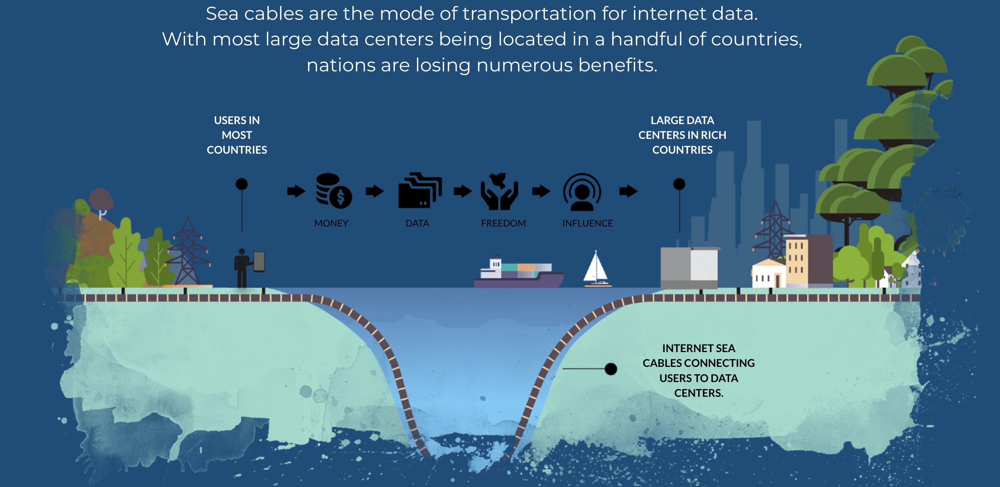
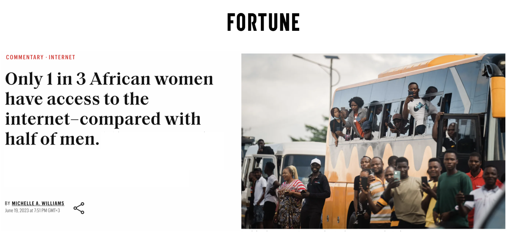
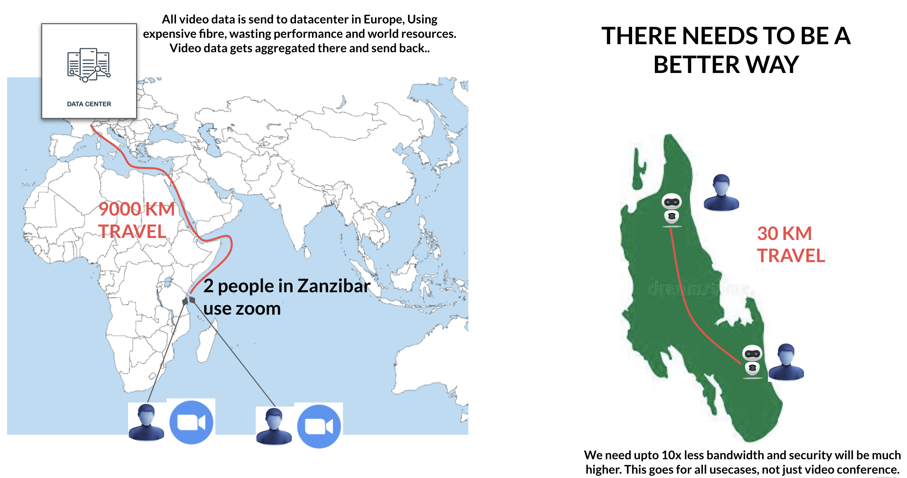
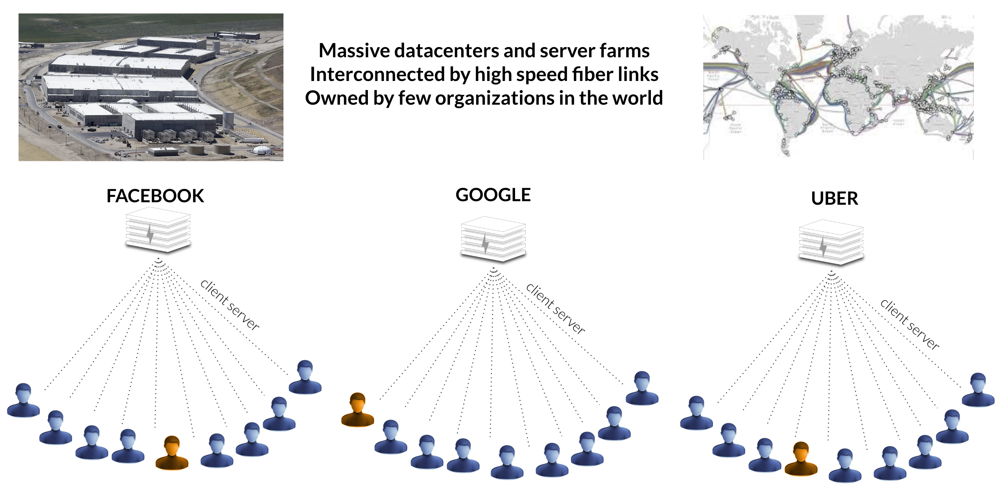
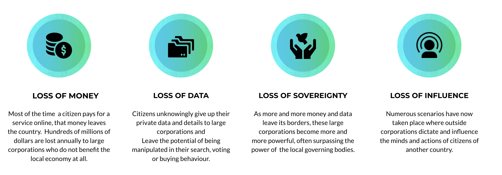

# Countries don't have their own internet.

We believe Internet is as important as Reading & Writing but amazingly enough in Africa only 1 out of 3 Women have access to Internet.

### Countries have a long cable to the Internet.

The Internet was intended to be peer2peer but today this is no longer the case. The internet is seriously certralized if e.g. 2 people use Zoom they will probably be connected and services from a Datacenter in Europe, it just doesn't make sense.

### Centralized Datacenters.

Our Internet is produced from out of centralize datacenters, we became a product from companies like Facebook, Uber, ... 

This design leads to lots of issues, basically a couple of regions in the world produce +90% of all Internet applications.

We also exist 100 times, for each application a large scale server infrastructure is built and we exist in each of those. The amount of wasted resources is incredible.

This also leads to a design which is not convenient, we have to learn how to work with many different applications at the same time, and these applications are not integrated.

### Countries lose a lot of money

Centralized parties have access to the data of hundreds of millions of citizens, this makes us a product.

