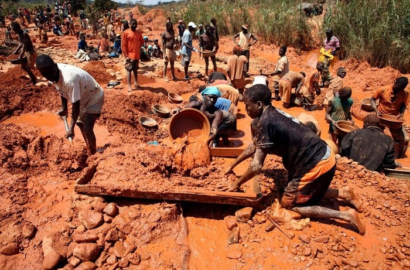
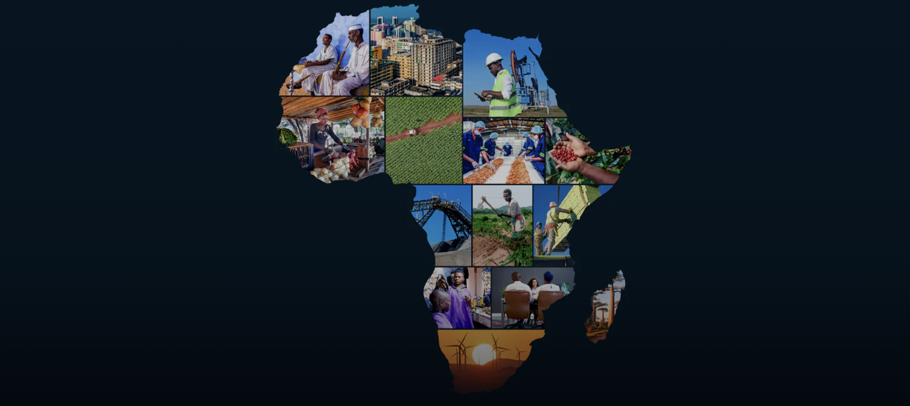

# Emerging countries are being extracted

Emerging countries are caught in a critical dilemma: the extensive extraction of natural resources and the steady exodus of their skilled workforce. While these nations are rich in resources like minerals and oil, the exploitation by multinational corporations often doesn't equate to local economic growth or improved living standards. This phenomenon, coupled with the large-scale migration of educated professionals seeking better opportunities abroad, significantly hampers the development potential of these regions.

## Statistical Insights and Implications

Data reveals a troubling trend. In Africa, despite its abundant natural wealth, there is limited economic benefit reaching the local populace. Annually, about 70,000 skilled African professionals migrate, seeking better prospects in developed countries. This brain drain depletes the continent of vital human capital essential for innovation and growth, exacerbating the challenges posed by resource extraction.

## Broader Societal Impact

The ramifications of these issues extend far beyond economics. Environmental degradation due to unsustainable mining practices, social unrest stemming from unequal wealth distribution, and the erosion of community structures due to brain drain are just a few of the cascading effects. These challenges collectively degrade the quality of life and hinder sustainable development in these regions.

## A Call for Timely Action

The need for immediate action is paramount. Without intervention, these disparities will likely worsen, deepening the exploitation and exacerbating talent loss. The situation calls for a concerted effort from global and local entities to devise and implement strategies that address these critical issues head-on.

## Pathways to Empowering  Solutions

Solutions lie in innovative approaches and equitable economic practices. Empowering local communities with technology and resources to develop sustainable practices can create viable alternatives to migration. Fostering local enterprise, alongside fair and sustainable use of natural resources, can stimulate economic growth while retaining talent.

## Our Collective Journey: Towards a Fairer Global Community

The responsibility to act lies with us all. Supporting initiatives that promote local development, fair resource distribution, and sustainable practices is crucial in building a more equitable and balanced global community. It's a collective journey towards a future where every nation has the opportunity to thrive without sacrificing its resources or its people.
