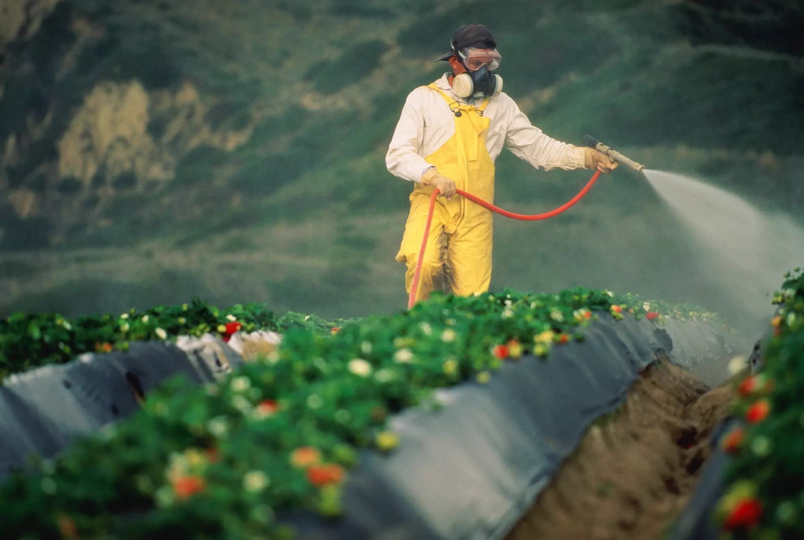

# Food is no longer food.

Over the last hundred years, the nutritional value of our food has seen a significant decline. This decrease is largely attributed to the extensive use of chemical fertilizers, which, while increasing crop yields, have led to soil degradation and nutrient depletion. Consequently, the food produced on such soils lacks essential minerals and nutrients, contributing to widespread health issues and global mineral deficiencies.

## The Alarming Trend: Facts and Consequences

The reliance on chemical fertilizers in modern agriculture has led to a paradox: an increase in food quantity but a decrease in its quality. This situation is exacerbating health issues related to nutritional deficiencies, impacting populations globally.

## Beyond the Plate: Wider Societal and Health Implications

The degradation in food quality affects not just individual health but also societal well-being. Poor nutrition can lead to increased healthcare costs, reduced productivity, and heightened susceptibility to diseases, creating a ripple effect across communities.

The urgency to address this nutritional crisis is paramount. Continuing on the current path of soil degradation and nutrient depletion will only further exacerbate the problem, making it a pressing issue that demands immediate attention.

## Reviving Soil, Restoring Nutrition: Innovative Solutions

Innovations like Earth Regenerators present a ray of hope. These organic soil improvement fertilizers can regenerate degraded lands and counteract the adverse effects of chemical fertilizers, thus reintroducing essential nutrients into the food chain.

## Embracing Collective Responsibility: A Sustainable Future in Food

The responsibility to act and address this issue lies with all stakeholders – farmers, consumers, policymakers, and innovators. By adopting sustainable agricultural practices and supporting innovative solutions like Earth Regenerators, we can collectively work towards a future where the food on our plates is not only abundant but also rich in nutrition.
