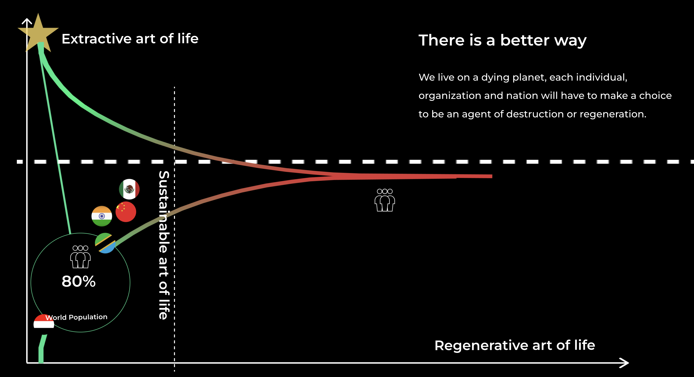
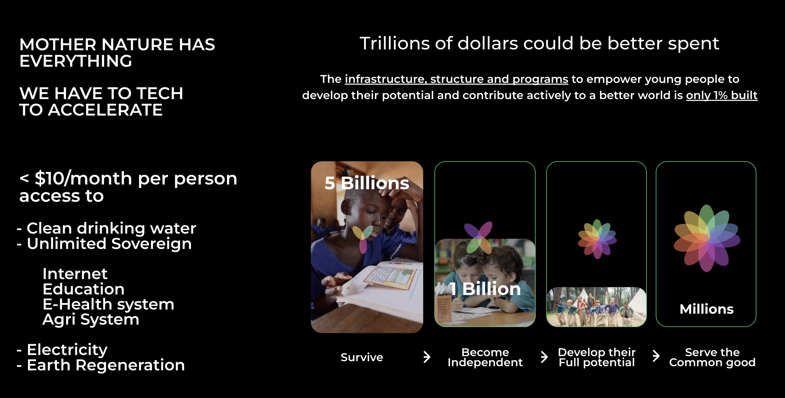

> instead of asking ourselves which planet are we going to leave to our children

> we should be asking ourselves what kind of children are we going to leave on this planet

## Help our kids to grow.

In Africa **80%** of the population is younger than 30, most of them are raised in poor circumstances and copy bad things from the west while not growing in their own power.

Say no to the pills, no to mass agriculture with chemical fertilizers, no to desertification.

Give tools and education to our children to grow in beautiful adults who dare to live in abundance and with love.

## Stop Extraction

Lets build a world for our children which is less extractive.

- The non emerging countries need to extract less and live more in balance with nature.
- Emerging countries, need to get access to the resources they have and increase their "sustainable art of life"

The tools to make this happen

- stop corruption
- implement a peer2peer digital backbone solution which gives everyone equal changes
- help mother nature to heal us.

## Lets get out of survival mode.

Billions of people are living in survival mode, what if we focus on helping them to become sovereign which allows them to develop their full potential, this then allows millions to serve the common good. Its very difficult to do so if you are in survival mode.

Mother Nature is so powerful, she has everything we need to restore our beautiful planet.

We as OurWorld have opensource technology available which can help to accelerate this capability.

E.g. our earth regenerator can regenerate the land 30x faster than nature can allone.

<!-- ### Say no to Holywood and Big Investors

A new platform is needed which allows our young population to manage their future differently.

We need a shift from centralization to community based working. -->
