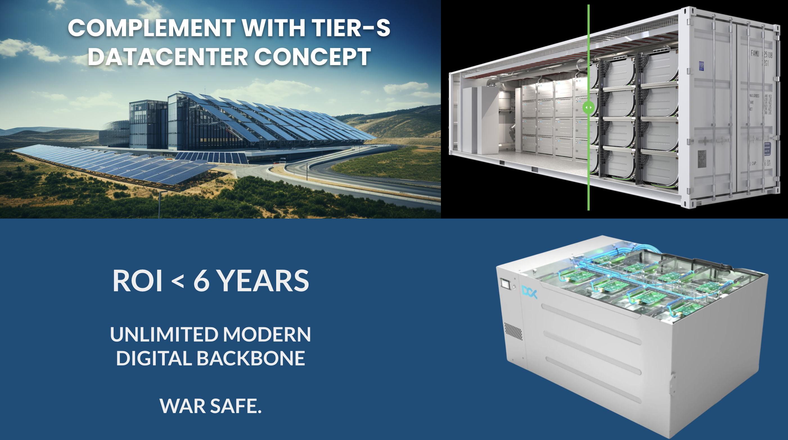
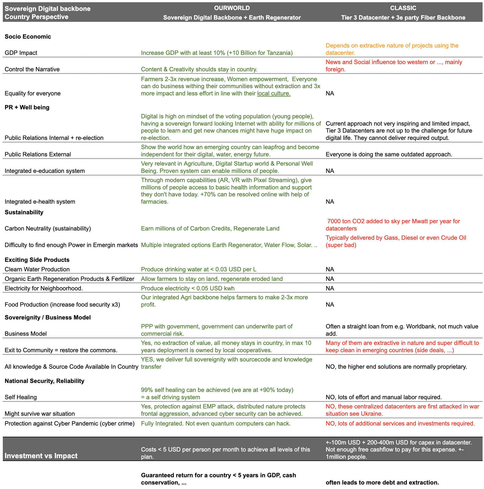
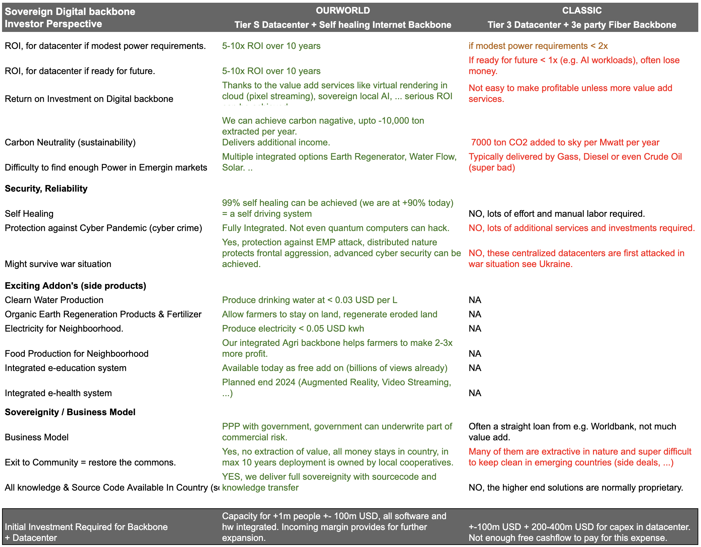
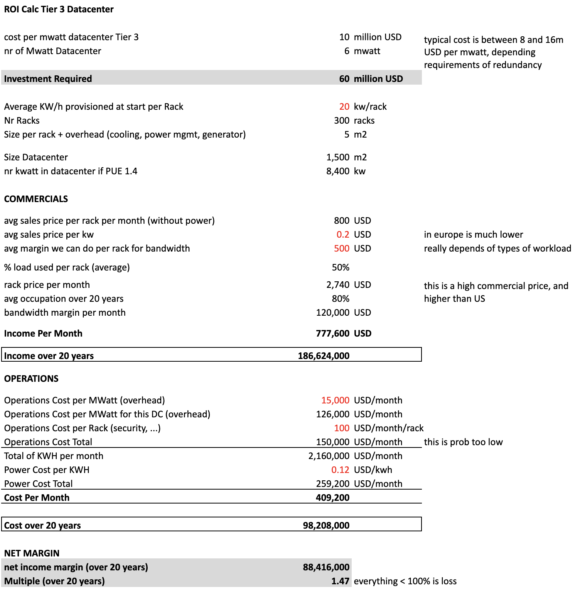
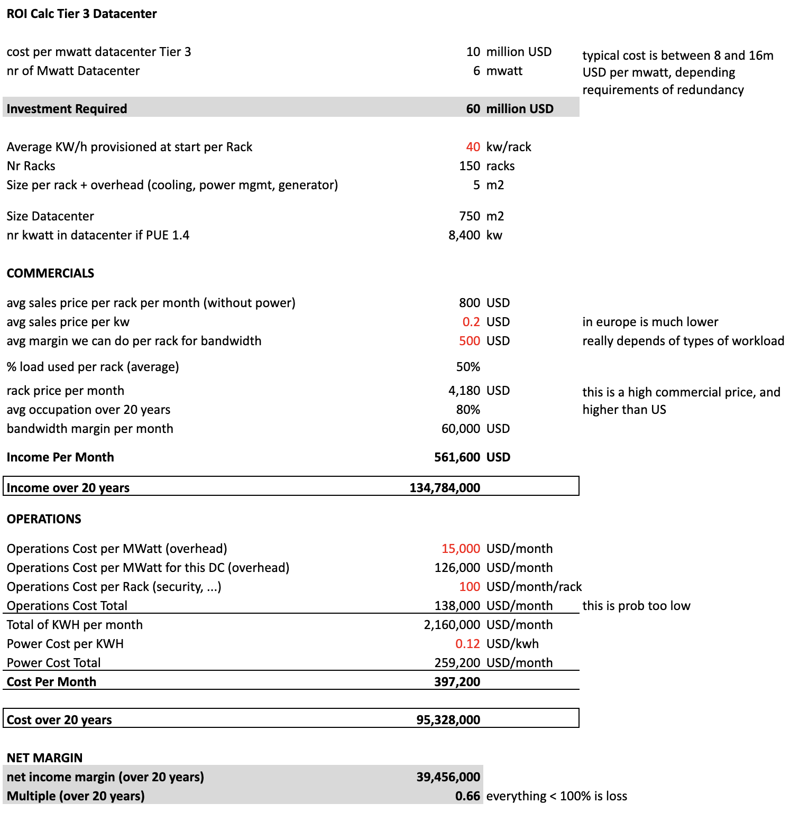

# Datacenters are Outdated

## Why is this important for the customer e.g country.

## Why is this important for Investors.

## Tier 3 Datacenters are not economical

At 20kw per rack which is way too low in comparison to the requirements for AI, such a datacenter barely makes a return over 20 years.

If we make same calc but with 30 kw per rack, which still low the datacenter makes a loss.