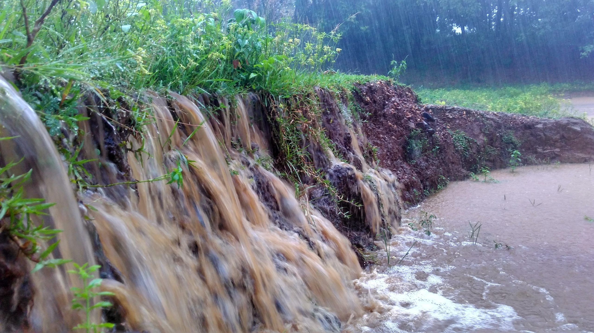

# Water & Land Erosion

Soil and water erosion pose a significant threat to global food security and ecosystem health. A comprehensive global study, encompassing over 35 million observations, shows soil erosion rates varying considerably across country borders. This variation underscores the substantial impact of agricultural policies and practices on erosion rates, emphasizing the need for sustainable land management.

## Underlying Causes and Far-Reaching Effects

Soil erosion, driven by natural forces and human activity, strips away fertile topsoil, vital for plant growth, resulting in diminished crop yields. Water erosion contributes to sedimentation in water bodies, disrupting water quality and aquatic ecosystems. Both forms of erosion also exacerbate biodiversity loss and climate change impacts.

## The Simplicity of Solutions: Harnessing Nature's Resilience

Despite the severity, solutions to combat soil and water erosion are straightforward, leveraging nature's inherent resilience. Agroforestry, sustainable farming practices like crop rotation, contour farming, and cover cropping, are effective in mitigating erosion, preserving natural habitats, and ensuring the longevity of agricultural lands.

## A Collective Call to Action: Implementing Sustainable Practices

The responsibility to address these environmental challenges is collective. By implementing proven sustainable methods, we can significantly curb erosion, safeguarding our food security and preserving the health of our planet for future generations.
