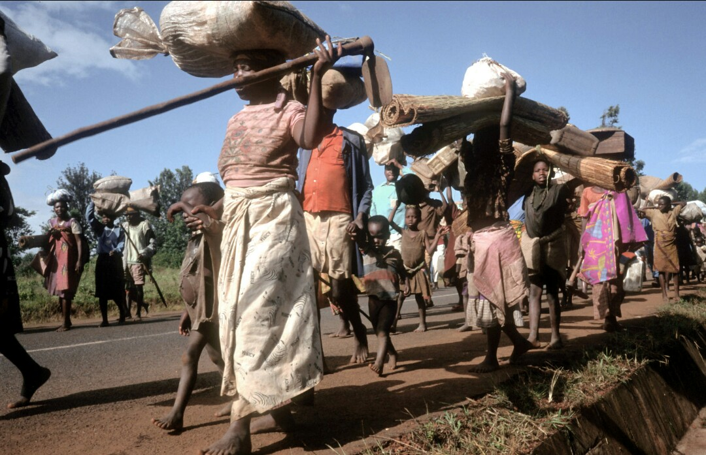

# Migration to Cities?

Urban migration isn't just about seeking better opportunities; it's often a survival strategy in response to environmental degradation and economic necessity. Detailed demographic studies reveal significant portions of rural populations moving to cities annually, reshaping economic and social landscapes.

Many believe that this is inevitable, but why would this be?

## Quantifying the Drift: Numbers Speak

Millions globally migrate to urban centers each year. This massive movement influences labor markets, housing demands, and urban planning, reflecting a critical shift in population dynamics.

According to the United Nations, current global estimate is that there were around 281 million international migrants in the world in 2020, which equates to 3.6 per cent of the global population.

## Impact Analysis: Urban Burden, Rural Void

From 2015 to 2050, the world’s urban population is expected to nearly double. However, many of the world’s fastest-growing cities are already struggling to handle their own climate issues. From rising seas to freshwater scarcity, the complex interplay of climate change, population growth and fragility in cities has made them hotbeds for social and economic inequalities — increasing the risk of violence and having a profound impact on human security in urban centers around the world.  

## Time for Change: Addressing the Root Causes

A more sustainable approach would be to empower people in their local environments with tools and resources for regenerative and sustainable development. This can help maintain community ties, preserve cultural heritage, and improve living conditions without the need for mass migration to urban areas.

## Rural Renaissance: Pioneering Sustainable Alternatives

Investments in rural infrastructure, technology, and local businesses can create attractive living conditions, curbing the urban influx and promoting regional economic growth.

There are emerging solutions addressing these root causes, offering more sustainable alternatives. Innovative approaches in agricultural practices, digital connectivity, and local enterprise development can empower individuals in their communities. By focusing on creating opportunities and enhancing living conditions locally, we can reduce the necessity of urban migration. This approach is not only practical but also essential in building a more equitable and sustainable future. It aligns with our belief that it's our collective responsibility to act on these pressing problems and contribute to creating a better world.

