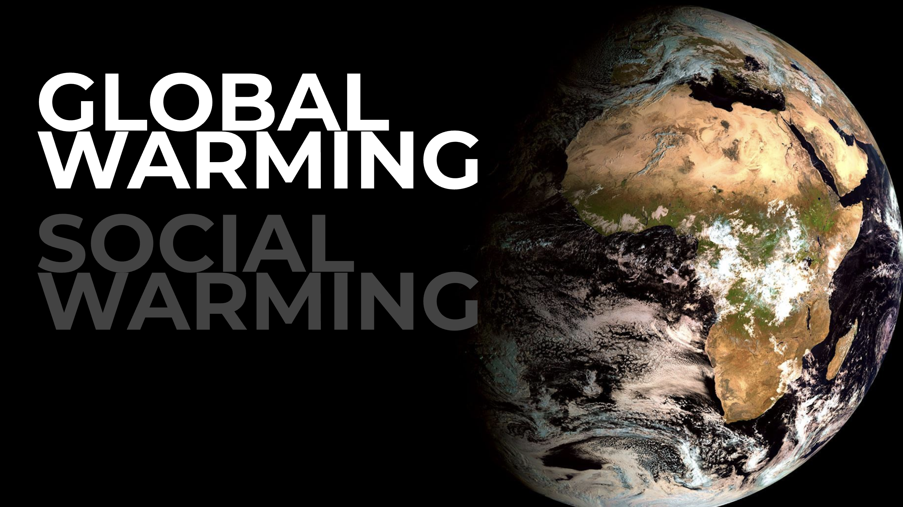
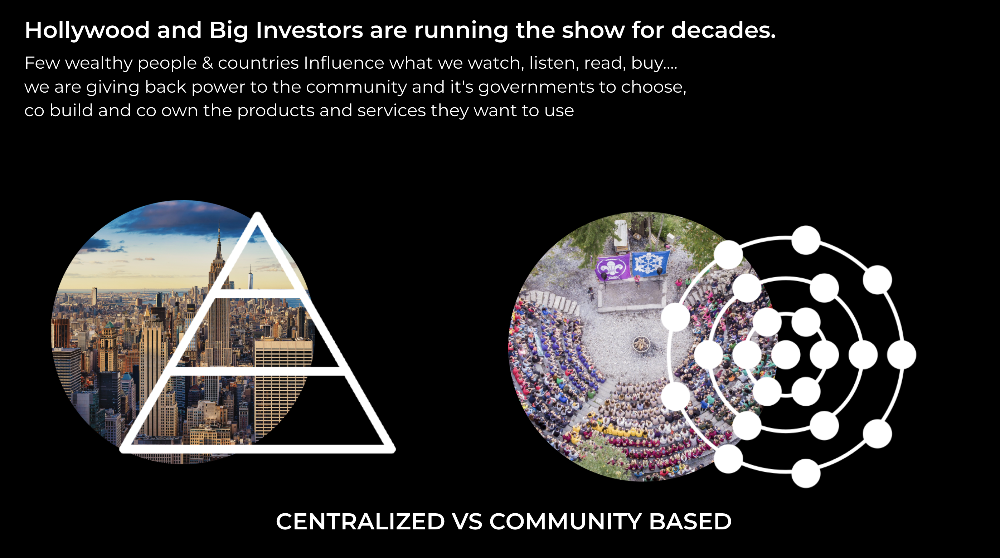

> There is too much talk in this world and not enough practial action.

At ourworld we have created a concrete plan to achieve below described goals. Together with our partners we have all technology available to make this happen.

We exists to resolve the following concrete issues:

- [We don't help our kids](help_our_kids.md)
- [Countries don't have their own Internet](countries_have_no_internet.md)
- [Shortage of Electricity](electricity_shortage.md)
- [Access to Clean Water](water.md)
- [Datacenters are wrongly built.](improve_datacenters.md)
- [Land Erosion](land_erosion.md)
- [Food is no Longer Food](food_no_longer_food.md)
- [Migration to Cities is inhumane](migration_to_cities.md)
- [Extraction Capitalism](extraction.md)

### Our Earth Regenerator helps nature & countries.

- Stop desertification (land degradation)
- Stop hunger, make sure everyone has clean water and access to healthy food. There is enough for everyone.
- Stop the migration to cities, allow our children to grow up in nature and maintain connection with mother earth.
- Make sure everyone has equal chances to a prosperous and abundant life. There is no reason to live in survival mode.
- Helps countries to become sovereign and and stops extraction of their resources.

### Say no to Holywood and Big Investors

We cannot create a new future by keep on doing what we have been doing before (Einstein).

A new platform is needed which allows our young population to manage their future differently.

We need a shift from centralization to community based working.

### Solution Matrix

|                          | ThreeFold | Sikana | OurVerse | earth regenerator |
|--------------------------|:---------:|:------:|:--------:|:-----------------:|
| help our kids, education |     Y     |    Y   |     Y    |                   |
| sovereign internet       |     Y     |    Y   |     Y    |         Y         |
| clean energy generation  |     Y     |        |          |         Y         |
| clean drinking water     |     Y     |        |          |         Y         |
| better datacenters       |     Y     |        |          |         Y         |
| stop extraction of value |     Y     |    Y   |     Y    |         Y         |
| regenerate land          |     Y     |        |     Y    |         Y         |
| real food                |     Y     |    Y   |     Y    |         Y         |
| stop migration to cities |     Y     |    Y   |     Y    |         Y         |
|                          |           |        |          |                   |

together with our partners we have the full set of solutions:

|                          | WayOut | Freyr  Batteries | VVerse |
|--------------------------|:------:|:----------------:|:------:|
| help our kids, education |        |                  |    Y   |
| sovereign internet       |    Y   |         Y        |    Y   |
| clean energy generation  |        |         Y        |        |
| clean drinking water     |    Y   |         Y        |        |
| better datacenters       |        |         Y        |        |
| stop extraction of value |    Y   |         Y        |    Y   |
| regenerate land          |    Y   |         Y        |        |
| real food                |        |                  |        |
| stop migration to cities |    Y   |         Y        |    Y   |
|                          |        |                  |        |