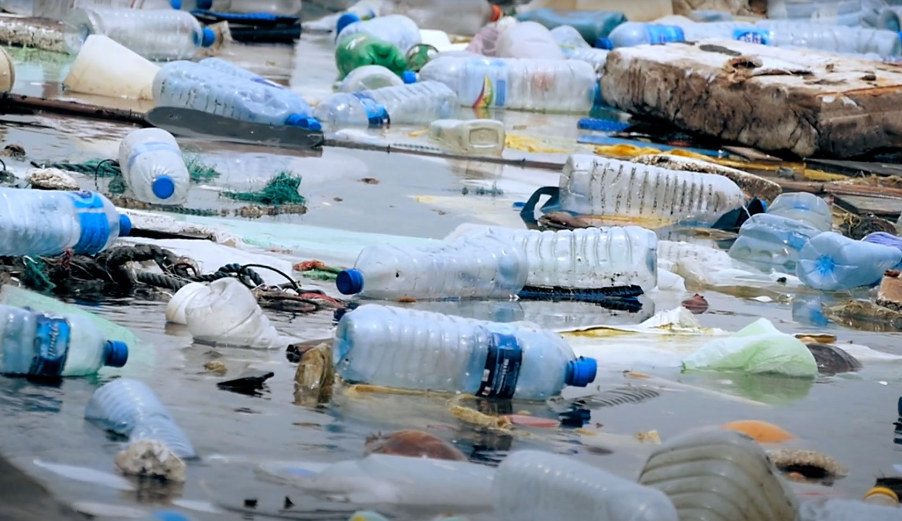

# Water & Plastic

Emerging research, including insights from Clean Water Action and Earth.org, underscores a growing health crisis stemming from plastic in water. 

Microplastics and toxins from plastic bottles are contaminating our water sources, posing significant risks to human health.

## Unseen Dangers: Microplastics in Our Water

Studies reveal alarming levels of microplastics in drinking water, with potential long-term health consequences. This issue extends beyond environmental concerns, directly impacting human well-being and public health.

## Broader Implications: Environmental and Health Effects

The proliferation of plastic in water systems affects ecosystems and poses risks to marine life, ultimately impacting human food sources and health.

## Urgent Remedies: Safeguarding Our Water and Health

Immediate solutions are essential. Improving water quality and reducing plastic use can significantly address these health risks. Emphasizing sustainable practices is crucial for public health.

## Pathways to a Healthier Future: Sustainable Water and Waste Practices

Encouraging recycling, eco-friendly materials, and advanced water filtration systems are key steps toward a sustainable and healthy future.

